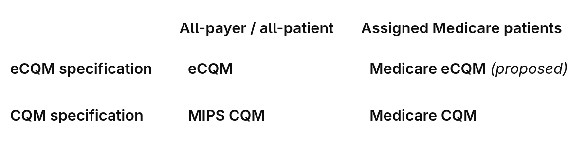
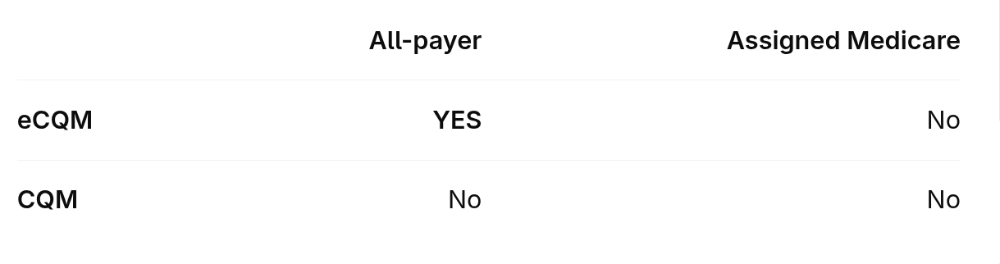

As I come up to speed in a new role, I'm learning a lot about how ACOs collect clinical data, calculate quality measures for CMS, and report them. The rules are... complex, especially for a newcomer. And there are multiple options with distinct requirements and implications. This article is just consolidating my nascent understanding of the reporting options; I'd welcome any feedback and (especially) corrections!

### Background

The ACO program exists to promote value-based care -- i.e. helping primary care providers to drive down the cost of care while improving quality and patient experience. ACOs that achieve high quality are eligible for their full share of any financial savings (or a reduced share of any losses if costs come in above the benchmark).

**"APP Plus" is the quality-measure set that Medicare Shared Savings Program ACOs submit to CMS to determine this "quality".** It replaced the prior APP set beginning in 2025, focusing on a smaller primary-care core (chronic-disease control, preventive screening, and behavioral health) alongside claims-based outcomes and patient experience. In 2026, eight measures are in the set; five require ACO-submitted clinical results.

Under the CY 2027 *proposal*, the reporting options for these clinical measures map into this 2×2:

Reporting based on an **all-payer/all-patient** population can qualify for a "reporting incentive": if all five clinical measures are reported at the population level and clear some de minimus thresholds for completeness and performance, then CMS "deems" the ACO to meet the quality performance standard. *This unlocks full shared savings rates for the ACO.*

Reporting based on **assigned patient** population (roughly: just your Medicare patients) would allow you to compute your quality against "flat benchmarks", meaning your quality scores are based linearly on your measure rates rather than "graded on a curve" against other providers.

(If this all seems a bit complicated -- yes! Teaser in this post's banner image: I'm working on a little open source simulator with a visual language for thinking about these concepts.)

### ... and an asymmetric bonus

The "**Complex Organization Adjustment" (COA)** is a special bonus available only if you use eCQM to report on the full population:

The COA adds a point to your measure score for every measure you've reported as a full-population eCQM. For ACOs using a mix of reporting options for different measures, this can help boost scores in a regime where every point improves the shared savings rates (up to the quality standard, which acts as a ceiling). Even for ACOs reporting all five measures as full-population eCQMs (which ~automatically meet the quality standard and therefore get full shared savings by virtue of "deeming"), a higher score can limit mitigate expose to shared losses (down to a 40% floor).

(The raw score can also be important as a claims-fee-multiplier for providers that don't meet the definition of "qualified providers" within their ACO -- but this too far in the weeds for an introductory post, and the proposed rules leave the details in flux.)

### Submitting quality results

Submission of quality measure results is a separate layer, independent from the selected reporting options. CMS permits APP quality data in **QPP JSON or QRDA III**; the direct QPP Submission API always uses JSON.

### Sources

* [CMS — CY 2027 PFS Proposed Rule: MSSP Proposals](https://www.cms.gov/newsroom/fact-sheets/calendar-year-cy-2027-medicare-physician-fee-schedule-proposed-rule-cms-1848-p-medicare-shared)
* [CMS — PY 2026 MSSP Quality Performance Standard](https://www.cms.gov/files/document/medicare-shared-savings-program-quality-performance-standard-performance-year-2026-40th-percentile.pdf)
* [CMS — CY 2025 PFS Final Rule: MSSP Provisions](https://www.cms.gov/newsroom/fact-sheets/calendar-year-cy-2025-medicare-physician-fee-schedule-final-rule-cms-1807-f-medicare-shared-savings)
* [CMS — Shared Savings and Losses Methodology, Version 14](https://www.cms.gov/files/document/medicare-shared-savings-program-shared-savings-losses-assignment-methodology-specifications-version.pdf-0)
* [QPP — 2025 APP Data Submission Guide](https://qpp-cm-prod-content.s3.amazonaws.com/uploads/3543/2025-APP-Data-Submission-Guide.pdf)
* [CMS/QPP — MIPS Value Pathways](https://qpp.cms.gov/reporting-requirements/ways-to-report/mvp)