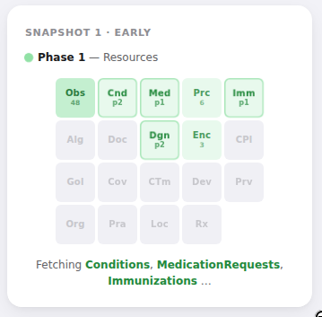
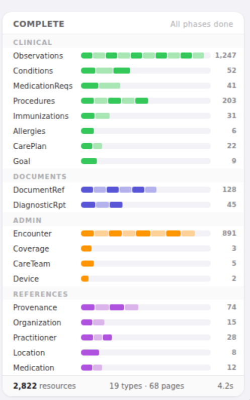
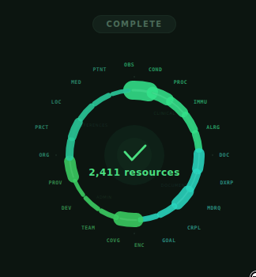
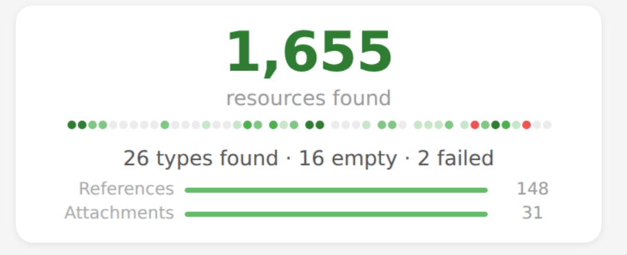

I'm building [Health Skillz](/blog/posts/health-skillz-why-i-built-my-own-health-record-connector-for-claude-ai-codex), a patient-facing app that helps people bring their healthcare data securely into their browser from provider systems -- and, from there, share it with an AI of their choice, with end-to-end encryption so only the AI can decrypt it.

When someone connects their patient portal to Health Skillz, the app fires off 44 FHIR queries in parallel to fetch all available US Core data — labs, vitals, conditions, encounters, medications, notes, and so on. The whole fetch takes anywhere from 10 seconds to 10 minutes depending on data volumes. Until this week, the UI for that was a spinner and a line of text cycling through resource names faster than anyone could read. It worked. Nobody complained. But every time I watched it, I thought, *I should do something with this.*

I hadn't, because "do something" felt open-ended and vague. I could half-picture many different approaches in my mind's eye, but I didn't want to spend half a day building a progress widget when there were real features to ship. So the spinner stayed.

Then over breakfast, I decided to explore options with a workflow that didn't exist just a few months ago. Using [exe.dev](http://exe.dev) with Shelley... in about 45 minutes I went through six rounds of prototyping (34 distinct visual designs for the same progress widget) and ended up with something I'm happy with:

Final Design

> [exe.dev](http://exe.dev) is an environment that pairs persistent Linux VMs with [Shelley](https://github.com/boldsoftware/shelley), an open-source agent harness leveraging Claude 4.6 Opus among other models to control a full environment with filesystem, shell, browser, and anything else you dream up. It can spin up sub-agents that work in parallel on independent tasks, each with access to the same tools. For this project, that meant six prototypes built simultaneously by six sub-agents, each rendering its HTML file and taking a browser screenshot, while I went and got coffee.

### Six ideas at once

I started by describing the problem and asking for six completely different approaches — not variations, but six distinct visual metaphors for showing progress across a batch of parallel queries. A heatmap grid like GitHub's contribution chart, a waterfall like Chrome DevTools, a treemap where rectangles grow with data volume, a radial donut, a minimal text ticker, and a mosaic of labeled chips.

Shelley spawned six sub-agents and each built a standalone HTML prototype in isolation. A few minutes later, I had six files to open, each showing the widget at three stages: early, midway, and complete.

Some were good. Some were ugly. A couple missed the mark entirely. But something useful happened as I looked through them: my vague sense that the spinner "could be better" turned into specific opinions. The waterfall felt too technical. The radial chart looked cool but was hard to parse quickly. The ticker was too sparse. The mosaic had an interesting density. I couldn't have told you any of that before I saw the prototypes. I learned what I wanted by seeing things I didn't want.

---

### The brief writes itself

I gave quick feedback and asked for another round. And another. The conversation was fast — a few sentences of reaction, sometimes voice-transcribed with typos, then six more prototypes.

What surprised me was how the problem definition evolved alongside the visuals. In round two, I noticed that every prototype was allocating space per *page of results* — as if we already knew labs would have eight pages and vitals four. We don't. We learn that as pages come back. I hadn't thought to specify this because I hadn't thought about it. Seeing it violated six different ways made it obvious. From then on, the brief included: "44 fixed slots, pre-allocated, no layout changes ever."

In round three, looking at prototypes where finished-but-empty slots looked identical to not-yet-started slots, I realized the state model needed to be explicit: pending, active, done, empty, error — five states, each visually distinct. I hadn't reasoned that out ahead of time. It came from looking at a prototype and thinking, *Wait, I can't tell what's happening here.*

Each round, the brief got tighter. Not because I sat down to write a spec, but because each batch of prototypes surfaced assumptions I hadn't examined. By round five, I had a brief that was genuinely precise — 44 query slots in 7 named groups, five visual states with specific color tiers for data volume, three sequential phases, pre-allocated progress bars for all of them. That brief didn't exist in my head at the start. The prototypes drew it out.

> If you want to see exactly how this worked (the actual prompts, the shared spec documents that evolved round over round, how "there should be a clear way to visualize empty vs. errored" turned into a five-state model with exact hex codes)... I wrote up a [detailed development journal](https://github.com/jmandel/health-skillz/blob/vnext/blog/progress-widget-design/journal.md). The most interesting thing in there isn't the designs, it's watching the sub-agent briefs get tighter. Each round of feedback about the prototypes was really feedback about the prompt.

---

### Picking one

The sixth round produced six final candidates against that tight spec/ I chose "Counter Hero + Dot Strip" — a big resource count front and center, with a single row of 44 tiny colored dots underneath. It's not the cleverest design. The chip grid packs more information. The stacked bars show group structure better. But for a loading screen — something that should provide reassurance without demanding attention — the big number just works. You glance at it, you see "1,200 resources found" and a row of green dots, and you know things are going well. That's all a patient needs from this screen.

Refinement passes to make sure references and attachments progress bars were pre-allocated to avoid "backward progress" animations, then Shelley wrote up a full implementation plan, and a fresh agent picked it up and built the React component.

---

### What this means

There are a lot of tasks like this in software development. Not hard, exactly, but wide open — problems where many solutions are reasonable, your first idea would be fine, and the only way to know if you can do better is to try a bunch of things. Usually, you don't try a bunch of things. You pick one, build it, ship it, move on. The cost of exploration is too high relative to the value of a marginally better answer.

What changed here is the cost. Six parallel prototypes, built and screenshotted in minutes. Feedback applied, six more. The whole process took about 45 minutes, most of which was me looking at things and thinking.

This feels genuinely new as a way of working, and I'm still making sense of it. It shifts design from a constructive process — reason about the problem, synthesize a solution — to a reactive one. You generate options, then pattern-match against your own taste. That's a tradeoff. It's faster and surfaces ideas you wouldn't have had on your own, but you're exercising a different cognitive muscle than when you think carefully from first principles. If this became the only way you designed, you'd lose something. The careful thinking matters, and it produces things that reactive selection can't.

But for most design decisions on a project like this — a solo developer building an open-source tool — careful first-principles design was never the realistic alternative. The realistic alternative was ten minutes and then move on. Against that baseline, 45 minutes of reactive exploration is a massive improvement, both in output quality and in what I learned along the way.

The thing I keep coming back to is that the prototypes I rejected taught me more than the one I picked. Each round, I understood the problem better — not because I thought harder about it, but because I saw concrete things that were wrong and could articulate why. The 33 rejects aren't waste. They're the process by which the 34th became the right answer.

[Browse the full gallery of all 34 prototypes →](https://github.com/jmandel/health-skillz/blob/vnext/blog/progress-widget-design/index.html)

---

Health Skillz is open source at [github.com/jmandel/health-skillz](http://github.com/jmandel/health-skillz).