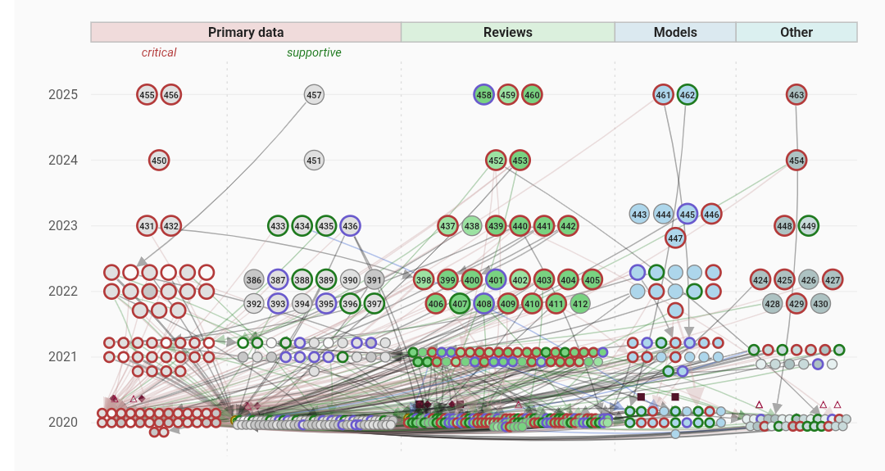
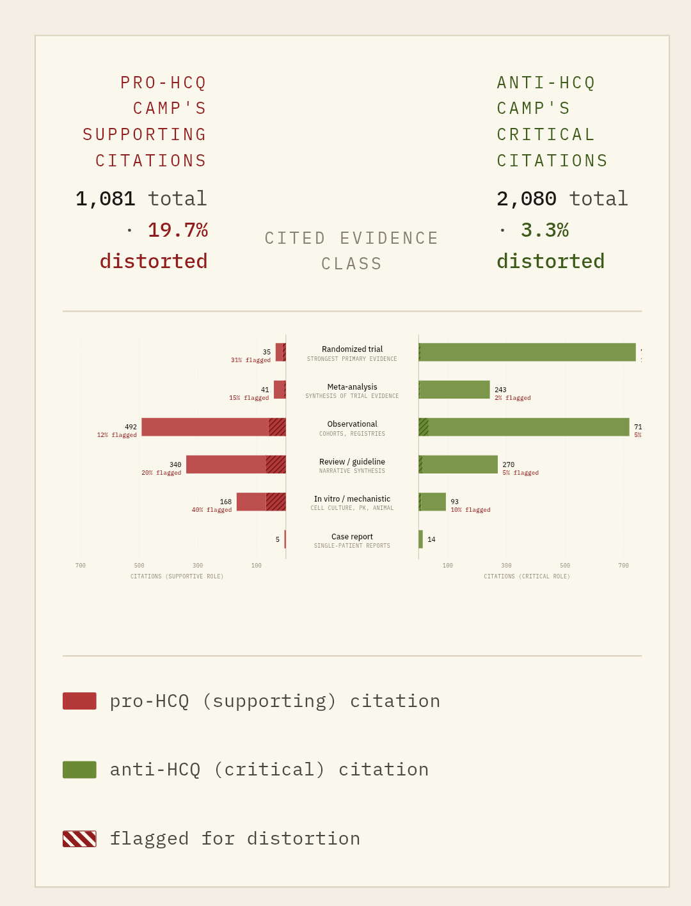

---

Isaac Kohane [posted a challenge](https://x.com/zakkohane/status/2044794966405194117) on April 16: build a citation-distortion network like [Steven Greenberg's 2009 BMJ figure](https://pubmed.ncbi.nlm.nih.gov/19622839/), but AI-driven and reproducible for any claim. "There is a lot of AI work in this area but none to my knowledge could reproduce the figure below. Please prove me wrong. #citationNetworks"

[Greenbergolem](https://github.com/jmandel/greenbergolem) is my attempt with Claude Opus 4.7. I built this in 3-4 hours of my time, creating a pipeline that audits any scientific claim whose literature is reachable in open-access full text. Starting example: "Hydroxychloroquine improves clinical outcomes in patients with COVID-19" -- this runs in about 12 hours of wall-clock subagent compute (Claude Code managing ~10 parallel copilot subagents). Interactive output at [joshuamandel.com/greenbergolem](http://joshuamandel.com/greenbergolem) (or read on for derails and structured output).

### What Greenberg did

Greenberg manually traced 242 papers on β-amyloid in inclusion body myositis. For each paper he classified the intrinsic stance, read the sentences around every citation, typed each citation by rhetorical role, and surfaced a decade of citation-driven authority around a claim the primary data didn't support: narrative reviews amplifying supportive work, critical findings going uncited, preliminary signals hardening into stated fact.

The annotation was the work. Zak's challenge is whether a language model can do that annotation reliably enough to be worth reading.

### The pipeline

Nine tasks in sequence:

Four steps call LLM subagents (research, paper-profile, paper-judge, subclaim-label). The rest are mechanical — PubMed pagination, JATS parsing, citation-marker extraction, edge aggregation, HITS authority scoring, metric computation, SVG layout.

The conceptual split that makes it reusable is four-tier:

* **Epistemic primitives** (role, stance, relevance enums) — universal rhetorical vocabulary, baked in.
* **Canonical catalogs** — evidence-class taxonomy (rct, observational-clinical, meta-analysis, narrative-review, mechanistic-surrogate, …) and citation-invention taxonomy (dead-end, transmutation, diversion, back-door, retraction-blindness). Shipped as shared data; "catalog": "biomed" gets you all of it.
* **Metric templates** — within-group-supportive-share, authority-top-k concentration, role-ratio-complement, invention-rate. Pure functions in lib/metric-templates.ts. Unit-testable.
* **Claim-local config** — ~30 lines of JSON per run: claim text, subclaim decomposition, PubMed include/exclude queries, year window, optional hints. The research subagent produces it.

For a new biomedical claim, the claim pack is the only thing authored.

### Where judgment gets automated

paper-judge is the interesting step. One subagent call per citing paper, batched into chunks of ≤10 cited papers. The agent is handed the full body of the citing paper, the full body of each cited paper, and every pre-extracted citation sentence between them. It returns, per occurrence: on-claim or not, role, subclaim(s) engaged, optional invention-type tag, and short verbatim quotes from both the citing and cited passages.

That is a reasonably faithful mechanization of what Greenberg did by hand — reading two papers and deciding what the citation is actually doing. Two design choices made it work in practice:

1. **Full text on both sides.** Abstract-only judgments confuse roles often enough to corrupt the graph. Europe PMC's JATS endpoint covers most of the 2020–2025 HCQ literature in full.
2. **Evidence quotes as structural discipline.** The output schema forces the subagent to produce a short quote from the citing sentence and a short quote from the cited paper *before* assigning a role. The rationale then has to reconcile those quotes with the label. It catches most hallucination at the source.response

The traditional AI pitch on literature review is search and summarization. The harder and more valuable part is adjudication — deciding what a specific citation is doing to a specific claim. That adjudication is what the pipeline mass-produces.

### The HCQ run, by the numbers

For my automated run on the hydroxychloroquine claim:

* 2,142 papers in the corpus; 1,168 from 2020 alone.
* 17,616 citation occurrences across the graph.
* 9,506 paper-to-paper edges — 4,595 supportive, 2,896 critical, 1,987 neutral, 28 mixed.
* 781 edges flagged with at least one citation-invention pattern.
* 16,237 individual occurrence judgments; 70% at confidence ≥ 0.9.

Wall-clock was dominated by paper-judge. Everything else is bounded by rate limits and I/O.

### The output is a structured, annotated graph in JSON

Everything lands in bundle.json — papers, edges, occurrences, judgments, per-metric results, per-subclaim breakdowns. The bundled HTML viewer is one consumer of that file, mimicking Greenberg's original visualization:

But with the structured data it's easy to create more in depth analyses and views. For example I handed bundle.json to a fresh Claude session and asked for a visualization. A few prompts of [back-and-forth](https://claude.ai/share/8ac52a72-3de0-41c0-8af2-34291328efe9) produced [this standalone audit report](https://claude.ai/public/artifacts/3cf59902-09c7-43fa-8cbc-906a03cac03e) — a different take on the same data, with editorial framing the canned viewer doesn't try to provide.

The analyst interface I care about isn't a UI. It's the bundle plus a chat window. Canned viewers lock you into whichever questions the UI was built to ask; ad-hoc analysis regenerates exactly the view the question needs.

### What this isn't

* **Not peer review.** LLM judgments are uniform in method, not ground truth. 70–90% agreement with an expert coder still leaves hundreds of mislabeled edges per run.
* **Not a meta-analysis.** Distortion patterns are structural signals, not effect sizes. The pipeline reports how citations behave, not whether the claim is true.
* **Not sound on paywalled literatures.** It needs full text on both sides of every edge. Closed-access fields will underperform.
* **Not self-calibrated.** The HCQ run has no held-out human annotation to compare against. Adding that is the highest-value next step.

### Back to Zak

Greenberg's 2009 figure was a multi-person, multi-month annotation project. Reproducing it on a new claim is now a weekend of model time plus a thirty-line claim pack. Cheerleading gratefully accepted.

Candidate claims on my list: the amyloid-cascade literature itself (Greenberg's own domain, as a replication check), the serotonin hypothesis of depression, "statins reduce all-cause mortality in primary prevention." Suggestions welcome.

---

### Artifacts

* [**Greenbergolem repo**](https://github.com/jmandel/greenbergolem) — pipeline, contracts, task specs
* intro.md — conceptual tour
* architecture.md — four-tier model, object shapes, metric templates
* [**HCQ run viewer**](https://joshuamandel.com/greenbergolem/) — interactive graph, filter by subclaim
* bundle.json — the full analysis output
* [**Ad-hoc audit report**](https://claude.ai/public/artifacts/3cf59902-09c7-43fa-8cbc-906a03cac03e) generated from the bundle, and [the session that produced it](https://claude.ai/share/8ac52a72-3de0-41c0-8af2-34291328efe9)