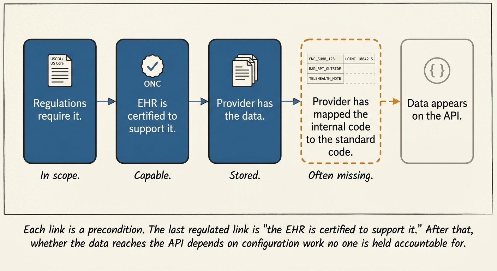
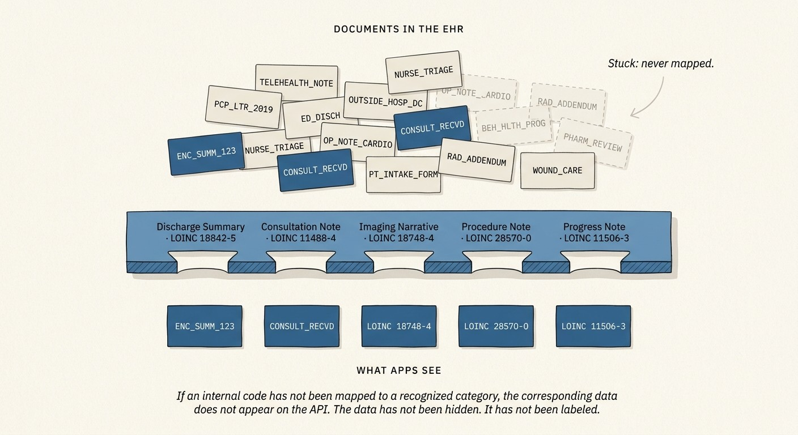

*Every step that requires a provider to map internal codes to external standards is a step where data drops out.*

If you're looking to work with health data, you might think you will be good to go when:

1. The regulations require it.
2. The standards specify how to expose it.
3. The EHR is certified to the standards.
4. The healthcare provider has the data in their system.

So when you call the API, you should get it. *But... the chain breaks at step 5: deployment.*

**The regulatory floor.** ONC adopts certification criteria through rulemaking. Those criteria incorporate USCDI, which names the data classes and elements that certified systems must support in plain language ("Discharge Summary," "Consultation Note"), and US Core, which specifies how to expose them in FHIR (which resource, which value set, which LOINC codes). ATLs test conformance, ACBs issue certifications. Regulatory intent, technical specification, and testing all point at the same target. The result is that a certified Health IT Module is *capable* of exposing each named category in a specified shape.

**Deployment.** At each provider organization, someone maintains the mapping from internal codes (ENC\_SUMM\_123, OUTSIDE\_PCP\_LTR) to the standard codes the API will emit. This is where capability becomes reality, and it is the only part of the stack no one is held accountable for.

The category schema looks like a filter when you read the spec, but it functions as a precondition for access. If an internal code has not been mapped to one of the recognized categories, the corresponding data does not appear on the API. The data has not been hidden. It has not been labeled.

Mapping does not happen comprehensively because the incentives do not support it. Comprehensive mapping requires analyst time and ongoing maintenance as new internal codes are added. Mapping wrong creates audit and privacy exposure. Mapping right does not unlock anything the provider organization is measured on, and patients and apps cannot see what they are not getting, so there is no feedback loop to drive completeness. Doing the minimum needed to pass certification is the rational equilibrium.

The structural fix I want to argue for is to **stop gating access on categorization**. Authorized apps should have the right to fetch all documents about a patient. **Categorization becomes an opt-in performance hint**, a way for an app to narrow a request when it only needs a slice, rather than a precondition for the data being reachable at all.

In that design, an app that needs everything can ask for everything, and a provider that has done careful categorization makes targeted queries cheap for the apps that want a slice. A provider that has not done careful categorization absorbs the cost of broad retrievals on its own infrastructure, which is a signal operations teams actually respond to. Picking a code stops being a high-stakes regulatory act and becomes a hint, which lowers the cost of getting it wrong and makes it easier for providers to choose codes that reflect what their data actually is.

---

### Coda: things you might think would fix this, that don't

**"Use AI to classify everything."** Modern models can infer what kind of note a note is. Classification is not the bottleneck. The bottleneck is adopting an automated classifier into a production EHR pipeline at every provider organization, validating it through compliance review, and trusting it to control what shows up on a regulated API. The provider's cost-benefit calculation does not change just because the classifier itself is cheap.

**"Use one API for both internal and external apps."** Vendors slice the category space finely enough that internal and external views diverge. USCDI clinical notes are exposed to patient-facing apps because regulation requires it. Non-USCDI buckets, like documents received from outside organizations, often are not, even when the mapping work has already been done internally for clinician-facing use.

**"Lean on information blocking enforcement."** Enforcement requires complainants who know what is missing. Patients and developers see what they get, not what they did not get. The cardiology consult that never made it onto the API is not something anyone files a complaint about.