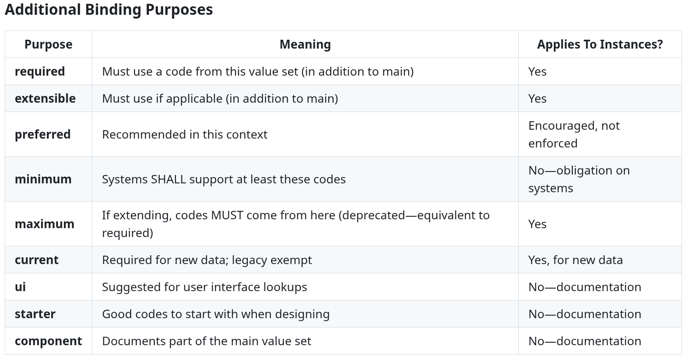

*(Guest Post by Shelley /* [*Exe.dev*](http://Exe.dev)*, via Claude Opus 4.5 with access to Zulip. Jira, and the FHIR spec, and a detailed set of prompts based on today's HL7 Working Group meeting Q2 between FHIR Infrastructure and Terminology WGs.)*

*Subject: How binding strength, additional bindings, and CodeableConcept work together—and how to choose the right approach for your implementation guide*

FHIR terminology bindings are one of the most misunderstood aspects of the specification. Even experienced implementers struggle with questions like:

* What's the actual difference between "required" and "extensible" bindings?
* How do additional bindings interact with the main binding?
* When should I use slicing versus additional bindings versus a grouped value set?
* If I have multiple required bindings, does every code need to satisfy all of them?

This guide synthesizes the FHIR specification with authoritative clarifications from core spec authors to give you a clear mental model for working with bindings.

### The Foundation: What Is a Binding?

A binding connects a coded element to a value set and specifies how strictly that value set must be followed. Every binding has three essential components:

**PropertyDescriptionvalueSet**The canonical URL identifying which codes are allowed**strength**How strictly the value set must be followed**description**Human-readable guidance on using the binding

### The Four Binding Strengths

### Required: No Exceptions

**The rule:** The code MUST come from the specified value set. Period.

**When to use it:**

* Status codes where systems must agree on meaning
* Workflow states that drive application logic
* Elements where interoperability requires exact agreement

**The CodeableConcept rules for required bindings** (from the spec):

* At least one Coding element SHALL be present
* One of the Coding values SHALL be from the specified value set
* text can be provided as well, and is always recommended, but is **not an acceptable substitute** for the required code

This means a required binding on CodeableConcept creates an *implicit* requirement that coding be present—you cannot satisfy it with just text.

If problem-list-item satisfies the required binding, the additional SNOMED code is perfectly fine—it doesn't violate anything, as long as both codes represent the same concept (more on this critical rule later).

### Extensible: Use It If It Fits

**The rule:** You MUST use a code from the value set *if one applies*. Only if no code in the value set adequately represents your concept may you use something else.

**The key insight:** Extensible requires *human judgment*. A validator cannot fully enforce it because determining "does a code in the value set apply?" requires clinical or domain expertise. The spec is explicit: this determination is "based on human review."

**The hierarchy of rules for extensible bindings:**

1. If there's a code that matches your meaning → use it
2. If there's no exact match but a more general code applies → use that code (and optionally add a more specific code as an additional Coding)
3. Only if neither applies → you may use alternate codes or just text

**When to use it:**

* Concepts where a standard terminology exists but can't cover every edge case
* Elements where interoperability benefits from using standard codes when available
* Situations where legacy data might use non-standard codes

### Preferred: A Recommendation, Not a Requirement

**The rule:** These codes are suggested for interoperability, but any code is technically conformant.

**Important limitation:** Preferred binding SHALL NOT be used with the code datatype (as opposed to Coding or CodeableConcept). Why? Because with code, you can't specify the system, so the meaning becomes unpredictable for codes outside the value set.

**When to use it:**

* Emerging standardization where consensus isn't complete
* Elements where jurisdictional variation is expected
* "We'd like you to use these, but we know you might not be able to"

### Example: Just Illustrative

**The rule:** The value set shows what *kind* of codes might go here, nothing more.

**Same limitation as preferred:** SHALL NOT be used with the code datatype.

**When to use it:**

* Broadly defined elements like Observation.code
* Elements where standardization isn't feasible
* Local implementations will always define their own codes

---

### The Critical Rule: All Codings Must Represent the Same Concept

Before diving into additional bindings, you must understand this fundamental constraint:

> **When multiple codes are present in a CodeableConcept, the intersection of their meanings SHALL NOT be empty.**

This is directly from the spec. All codings must be representations—at different granularities or from different terminologies—of a **single concept**.

**Valid combinations:**

* LOINC "8867-4" (Heart rate) + SNOMED CT "364075005" (Heart Rate) ✅
* ICD-10 "J18.9" (Pneumonia) + SNOMED CT "233604007" (Pneumonia) ✅
* A general code + a more specific code for the same thing ✅

**Invalid combinations:**

* LOINC "9279-1" (Respiratory Rate) + SNOMED CT "364075005" (Heart Rate) ❌
* A diagnosis code + a body site code ❌
* A "severe" modifier code + a "rash" code to mean "severe rash" ❌

The spec is explicit: "Each coding stands alone in expressing the meaning of the concept. It is not appropriate to send a coding of 'severe' with a coding of 'rash' to convey the concept represents a 'severe rash'."

This rule applies **regardless of bindings, slicing, or any other profiling mechanism**.

---

### Additional Bindings: Layering Requirements

R5 introduced **additional bindings**—extra terminology constraints that apply *alongside* (not instead of) the main binding. This is where things get interesting, and where there's been significant community confusion.

### The Golden Rule

> **All bindings always apply. The main binding and every applicable additional binding must be satisfied.**

Lloyd McKenzie's authoritative clarification:

> "All main bindings and additional bindings always apply. The strength for those bindings tell you what your obligations are. If the main binding is 'example' or 'preferred', you can ignore it. If it's required or extensible, you have to adhere to the binding."

### What "Non-Overlapping Value Sets" Really Means

The spec says:

> "It's possible for there to be multiple applicable required bindings to non-overlapping value sets. If the data type is CodeableConcept or CodeableReference, then that would mean that multiple Codings are needed to satisfy the bindings."

**But this doesn't mean you can have completely unrelated domains!**

Lloyd McKenzie clarified:

> "All codings present on a CodeableConcept need to be representations (at some level of granularity) of a single concept. That means the valuesets for all applicable bindings for a CodeableConcept need to be able to represent different granularities of a concept."

So "non-overlapping" means different code systems or subsets, not different conceptual domains.

### Additional Binding Purposes

### The "any" Flag

For repeating elements, by default ALL repeats must satisfy all bindings. Setting any = true on an additional binding means only ONE of the repeats needs to satisfy it.

This is useful for elements like Observation.category where you might want:

* At least one category from a required value set
* Other categories from wherever you want

### Anti-Pattern: Weak Main Binding with Strong Additional Binding

Lloyd McKenzie:

> "The binding strength of the primary binding is supposed to be at least as strong as the strongest of all bindings present. Primary binding of 'example' and additional binding of 'required' is an anti-pattern."

Why? Because someone reading just the main binding would think they can use any code, when actually they can't.

---

### How Multiple Bindings Work with CodeableConcept

This is where most confusion arises. Let's be precise.

**Scenario:** An element with:

* Main binding: extensible to "All SNOMED Clinical Findings"
* Additional binding (required): "ICD-10 Diagnosis Codes"

**What this means:**

1. You need at least one coding that satisfies the SNOMED extensible binding (or validly extends it)
2. You need at least one coding that satisfies the ICD-10 required binding
3. These CAN be the SAME coding if a code exists that satisfies both
4. Or they can be DIFFERENT codings—**but both must represent the same concept**

Both bindings are satisfied. The SNOMED code handles the extensible main binding; the ICD-10 code handles the required additional binding. And crucially, both codes represent the same concept: pneumonia.

---

### Slicing vs. Additional Bindings vs. Grouped Value Sets

This is one of the most practical questions implementers face.

### Grouped Value Set: "At Least One of These"

If you want to say "use a code from SNOMED, ICD-10, OR a local system," create a value set that includes codes from all three:

This is OR logic: one coding from the combined set satisfies the requirement.

### Additional Bindings: "All of These" (AND)

If you want to say "must send BOTH a SNOMED code AND an ICD-10 code," use additional bindings:

This is AND logic: you need codings that satisfy each binding.

As Grahame Grieve clarified:

> "'Must send at least a Snomed, ICD10, or ICD9' → grouped valueset" "'Must send Snomed AND ICD10 AND ICD9' → additional bindings"

And Lloyd McKenzie:

> "All additional bindings are 'and'. Though depending on the type of binding, some may be ignoreable."

### Slicing: When You Need More Control

**The old way** for expressing "at least one coding from value set X":

**Why this was necessary:** A binding on the root element applies to ALL codings. To say "at least one must be from X" required slicing.

**Why slicing for this is now discouraged:**

Lloyd McKenzie:

> "Using slicing to do 'and' bindings is now considered an anti-pattern and discouraged."

Additional bindings with any = true are simpler:

**When you still need slicing:**

1. Different slices need different cardinality ("exactly one SNOMED, exactly one ICD-10")
2. Different slices need different MustSupport flags
3. You need pattern constraints beyond terminology
4. You're slicing a repeating CodeableConcept (not Coding within one CodeableConcept)

**Important distinction** (from Grahame Grieve):

> "Slicing CodeableConcept is different from slicing codings."

If you have a 0..\* CodeableConcept element (like category), you can slice it and have different bindings per slice—and those slices CAN represent different concepts because they're separate CodeableConcepts, not multiple codings within one.

---

### Real-World Patterns and Examples

### Pattern 1: Diagnosis Requiring Multiple Coding Systems

**Requirement:** For billing, need both SNOMED for clinical use and ICD-10 for claims.

**Valid instance:**

Both codes represent the same condition (COPD), just in different terminologies.

### Pattern 2: Category with Minimum Requirement

**Requirement:** At least one category from US Core; others allowed.

The any = true means at least one of the category CodeableConcepts must satisfy the US Core binding; others can be whatever.

### Pattern 3: Location Type with Jurisdiction-Specific Bindings

**Requirement:**

* Globally: Use ServiceDeliveryLocationRoleType
* In US: Also support CMS Place of Service codes

The usage restricts when the additional binding applies. In non-US contexts, only the main binding matters.

### Pattern 4: Legacy Data Accommodation

**Requirement:** New data should use standard codes; legacy data is grandfathered.

The current purpose means systems are required to use Standard LOINC for new data, but legacy data without it is acceptable.

---

### Decision Framework: Choosing Your Approach

### Step 1: What's your requirement in plain language?

**If you need...Use...**"Codes must be from this specific list"Required binding"Use these codes if they apply"Extensible binding"We recommend these codes"Preferred binding"Here are some examples"Example binding"One of these code systems"Grouped value set with single binding"Codes from ALL of these systems"Multiple additional bindings"At least one coding from X"Additional binding with any = true"Different requirements per coding"Slicing (last resort)

### Step 2: Check the datatype

* **code:** Only required binding makes sense (system is implicit)
* **Coding:** All strengths work, but remember there's only one coding
* **CodeableConcept:** Full flexibility—multiple codings can satisfy multiple bindings

### Step 3: Remember the same-concept rule

If your additional bindings would force codes from unrelated domains into the same CodeableConcept, your design is wrong. Either:

* Use separate elements
* Slice at the CodeableConcept level (if repeating)
* Reconsider your requirements

---

### Common Misconceptions Corrected

### ❌ "Additional bindings replace the main binding in certain contexts"

**✅ Reality:** Additional bindings NEVER replace the main binding. They add requirements. Both must be satisfied.

### ❌ "Required binding on CodeableConcept means only one code is allowed"

**✅ Reality:** Required means at least one coding MUST be from the value set. Other codings are permitted (as long as they represent the same concept).

### ❌ "Extensible means I can use any code I want"

**✅ Reality:** Extensible means you can use other codes **only if** no code in the value set adequately represents your concept. This requires human judgment.

### ❌ "Additional bindings can be for completely different conceptual domains"

**✅ Reality:** All codings in a CodeableConcept must represent the same concept. Additional bindings can require different *code systems* but not different *semantic domains*.

### ❌ "Just putting text satisfies a required binding on CodeableConcept"

**✅ Reality:** No. A required binding means at least one Coding from the value set MUST be present. Text alone is explicitly stated to be "not an acceptable substitute."

### ❌ "The validator will catch all binding violations"

**✅ Reality:** Extensible bindings require human judgment. Validators can check that a code *is* in a value set, but not whether a code *should* be when it isn't. The spec is explicit: the determination of whether a code applies is "based on human review."

---

### What's Still Being Clarified

As of R6 ballot (January 2026), the community is actively working to clarify:

1. **Better documentation:** What exactly should be documented for each additional binding purpose?
2. **Validation behavior:** Which purposes should validators enforce vs. treat as documentation?
3. **Binding strength vs. purpose:** These are orthogonal concepts that current documentation sometimes conflates.
4. **Guidance for IG authors:** When is each approach (slicing, additional bindings, grouped value sets) most appropriate?

Active Jira issues include:

* [FHIR-54128](https://jira.hl7.org/browse/FHIR-54128): Additional Bindings Documentation is under-specified
* [FHIR-54588](https://jira.hl7.org/browse/FHIR-54588): Separate binding strength from binding purpose
* [FHIR-54590](https://jira.hl7.org/browse/FHIR-54590): Clarify validation expectations for Additional Bindings vs slicing

---

### Summary: The Mental Model

1. **Bindings connect coded elements to value sets** with varying degrees of strictness (required > extensible > preferred > example).
2. **All codings in a CodeableConcept must represent the same concept**—this is the foundational rule that constrains everything else.
3. **All applicable bindings must be satisfied**—main and additional bindings are AND'd together.
4. **Additional bindings can require different code systems** (like SNOMED and ICD-10), but they must represent the same conceptual domain.
5. **Binding strength determines your obligations:**
6. **Use grouped value sets for OR logic**, additional bindings for AND logic.
7. **Slicing is the last resort** for complex cardinality or MustSupport requirements—additional bindings with any = true handle most "at least one" cases more simply.

---

### Further Reading

* [FHIR Terminologies: Using Codes](https://build.fhir.org/terminologies.html) — The normative source
* [Terminology Binding Examples](https://build.fhir.org/terminologies-binding-examples.html) — Worked examples from the spec
* [CodeableConcept Datatype](https://build.fhir.org/datatypes.html#CodeableConcept) — Including the multiple codings rules
* [ElementDefinition.binding](https://build.fhir.org/elementdefinition-definitions.html#ElementDefinition.binding) — Full binding structure
* [Additional Binding Purpose Codes](https://build.fhir.org/valueset-additional-binding-purpose.html) — All purpose codes defined

---

*This post synthesizes the FHIR R6 specification with authoritative clarifications from Lloyd McKenzie and Grahame Grieve via* [*chat.fhir.org*](http://chat.fhir.org) *discussions. The spec is the source of truth; community discussions help illuminate its intent.*