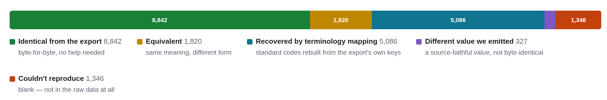
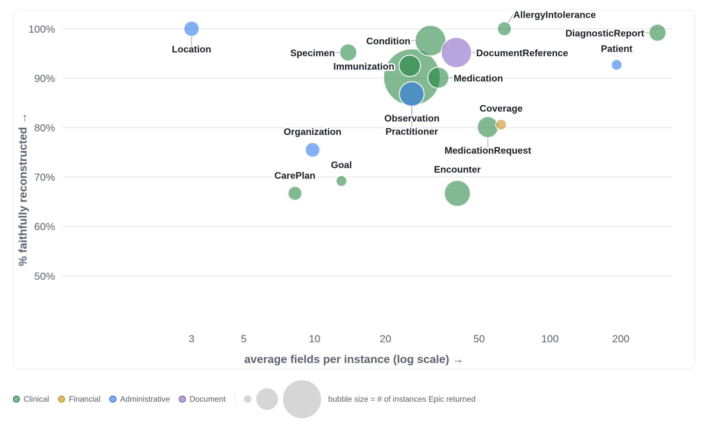

*Rebuilding (and improvig) Epic's FHIR from one patient's EHI export -- and how a tiny community of data contributions could cultivate a new kind of mapping pipeline.*

* *code:* [***github.com/jmandel/ehi-to-fhir***](https://github.com/jmandel/ehi-to-fhir)
* *interactive report:* [**joshuamandel.com/ehi-to-fhir**](https://joshuamandel.com/ehi-to-fhir)

Under ONC's health-IT certification rules, any patient can request an **EHI export**: a complete, machine-readable copy of the electronic health information their provider holds about them. Every major EHR has to support it as a condition of certification. **Epic's** version of that export is what I used here, and it is gloriously, intimidatingly raw: a near-complete dump spread across thousands of tab-separated tables. For my own record it came to **590 populated tables and about 25,000 rows**: order numbers, claim lines, flowsheet readings, note text, the works. Most people who open it bounce off immediately.

Two things make the export remarkable. It is *rich*, carrying far more than any FHIR API typically surfaces. And its schema is [**openly published**](https://open.epic.com/EHITables/GetTable/_index.htm), documented table by table. (Structurally these tables are very close to Clarity, Epic's reporting database.) That combination raised a question I couldn't let go of: starting from nothing but the raw export, how much of Epic's own [**FHIR API output**](https://fhir.epic.com/) could you reconstruct? (And could you improve upon it?)

I happen to have both halves of the picture for one patient: me. I have my EHI export, and I have my FHIR from Epic's API. So I treated them as a *paired sample*, EHI on the source side and FHIR on the target side, and asked a coding agent to bridge them.

### Mapping by example



Building a source-to-FHIR mapping usually means writing a specification, implementing it, and maintaining it as the source evolves: months of work and a standing team, repeated at every site. Here I skipped the spec and gave the agent **examples**. Here is the EHI, here is the FHIR Epic produced from it, make the first reproduce the second.

A single richly-populated record carries a surprising amount of the complexity you need. One patient still exercises dozens of resource types, repeating groups, coded and uncoded values, cross-references between resources, and plenty of messy edge cases. One record covers nowhere near everything, but it covers enough to *bootstrap*.

No LLM sits in the data conversion pipeline. The agent writes **deterministic TypeScript translators** (they live in src/), one per domain, that read the EHI and emit FHIR R4. The model authors the mapping; running it is ordinary, inspectable, reproducible code. You can diff it, review it, and run it a thousand times for the same answer. That property matters enormously for anything you'd want to trust with real data.

Output is checked by the **HL7 FHIR R4 validator** and by a **reference-integrity** pass that confirms every reference resolves to an allowed type. The part I'm proudest of is an element-by-element **tolerance ledger**: every element in the target FHIR is classified **EXACT**, **TOLERATED** (a justified, rule-verified difference), or **GAP**. Nothing is silently ignored.

### The scorecard

So how faithful is it? From one patient's EHI, the translators reconstruct **90.4%** of Epic's FHIR faithfully: 13,895 elements exact and 1,849 equivalent, out of 17,421 in the target.



The report draws this as a scorecard, one bubble per resource type, placed by how *rich* each instance is (average fields per instance) against how much we reproduced, and sized by how many of that type Epic returned. Some types come back essentially whole: **Location 100%, DiagnosticReport 99%, Condition 97%**, and Patient (a single 192-field resource) at **93%**. Others are harder. **Encounter is the floor at 67%**, and the high-volume Observations carry the largest absolute share of what remains. The hard cases sit exactly where you'd expect, on resources that lean on context the raw tables don't fully spell out.

One significant caveat: **terminology**. The EHI ships categorical values as local text, usually with no standard code attached, so LOINC, SNOMED, RxNorm, CVX, and ICD are *normally absent*. Rather than guess, the translators emit the text and omit the code. A separate recovered crosswalk, built by pairing the EHI's local codes with the standard codes that *do* appear elsewhere in the export, then lifts standard-coding coverage from a **10% baseline to 79%**. The report shows both views, so you can see exactly what the raw export gives you and what the crosswalk recovers.

### What a gap actually looks like

The GAPs sort into a few recognizable kinds. A handful of small ones build the intuition.

**A label locked in a dictionary the export never shipped.** Epic's FHIR shows the visit type ("Office Visit", "Telephone") on every encounter reference, but the export ships neither the encounter-type code nor the dictionary that spells out those labels.

```
Condition.encounter.display

target: "Office Visit"
ours: (absent)
```

**A flag the server stamps on the way out.** Some values are decorations the API adds at response time, with nothing in the raw data to derive them.

```
DocumentReference.type.coding.userSelected

target: true
ours: (absent)
```

**A field the export has no column for.** Epic's FHIR marks whether a provider is currently active; the provider directory in the export has no status column to read.

```
Practitioner.active

target: true
ours: (absent)
```

**A disagreement where we trust the export.** The API and the export sometimes report different instants for the same event. We emit the export's value; the API's lands a few seconds earlier, matching no source byte anywhere in the dump.

```
DiagnosticReport.issued

target: "2022-08-29T20:41:51Z"
ours:   "2022-08-29T20:42:02Z"
```

A smaller set are whole resources we can't rebuild: a few DocumentReferences exist only as API metadata, with no note body anywhere in the export to reconstruct from.

### Two things the comparison revealed

Building the mappings was the goal, but the same paired sample surfaced two findings I wasn't looking for.

**The EHI export has gaps, and sometimes the FHIR has more.** Plenty of data that looked "missing" was actually one join away, a "not in the export" verdict that dissolved once I searched the whole dump instead of the obvious column (CPT codes hiding in SVC\_LN\_INFO, marital status in CLM\_VALUES, and a dozen more). More interesting were the inversions, a few places where **Epic's FHIR API carried information the EHI export simply didn't**. Each one is a concrete, located, fileable opportunity to improve the export.

**The EHI carries whole domains the FHIR API doesn't expose at all.** Going the other direction, the raw export holds rich data Epic's FHIR endpoints don't surface today: the entire **billing and financial picture** (ExplanationOfBenefit, Claim, ChargeItem, Invoice, Account, PaymentReconciliation, CoverageEligibilityResponse), plus **Communication**, the secure MyChart messages between patient and care team. No reference FHIR existed to copy for these, so the agent built it from scratch, and it passes the validator clean. The EHI lets you map to FHIR resources that go *beyond* the current API surface.

### From one sample to many

The obvious caveat is n=1. One patient, one site's configuration, so rare paths and unusual data shapes stay unproven. By "faithful" I mean semantically equivalent: I emit the *true* EHI value even where Epic's FHIR shows a nickname or a corporate brand, so the meaning lines up even when the literal text does not. The resource IDs are synthetic but referentially consistent, and the terminology is best-effort. Treat all of this as a proof of concept.

The single-sample framing is also the most exciting part. If one paired source↔target record gets you to ~90%, a *handful* of records would converge quickly, contributed by different patients, from different sites, exercising different specialties and edge cases. The EHI schema is public, so the mappings derived from it can be a **shared community asset**. Several individuals, each contributing their own paired data, could converge toward a common set of high-quality targets instead of every site re-deriving the same mapping in private. The translators are open, the GAPs are a public to-do list, and each new sample fills more of them in.

That's what I find most promising. EHI→FHIR mapping has always been expensive for one reason: the months of painstaking, per-site work to discover and maintain the rules. A small amount of correlated data, in the hands of a capable agent, turns that into something a community can build together.

*The code is at* [*github.com/jmandel/ehi-to-fhir*](https://github.com/jmandel/ehi-to-fhir)*, with the translators in* src/. The interactive report (scorecard, per-resource breakdowns, and every tolerated and gap element with its rationale) is at [joshuamandel.com/ehi-to-fhir](https://joshuamandel.com/ehi-to-fhir). The whole thing rebuilds from public inputs with one command.