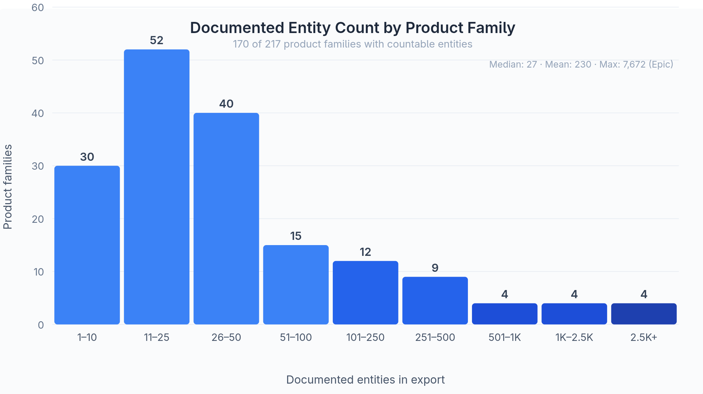
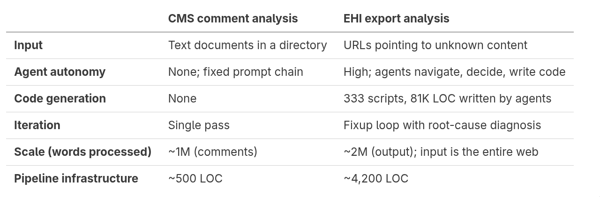
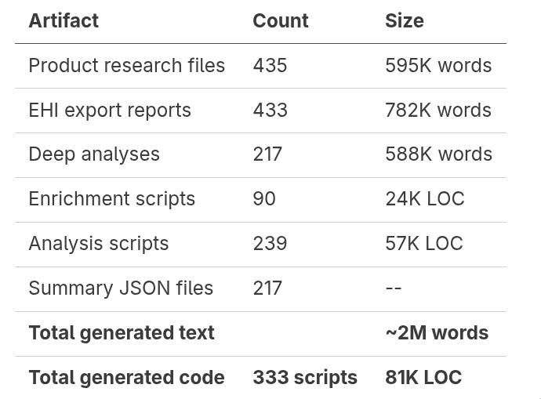

*This is the technical companion to "*[*I Graded Every EHR's Patient Data Export Documentation.*](/blog/posts/i-graded-265-ehrs-on-the-export-everything-requirement-median-grade-was-d)*" That post says what I found; this one says how I found it.*

### From 10,000 pages to 217 vendors

Last year I built a tool to [read 10,000 pages of public comments](https://joshuamandel.com/blog/how-to-read-10000-pages-of-public-comments/) on the CMS Health Tech Ecosystem RFI. The approach was a feed-forward prompt pipeline: restructure each comment into a standard template, discover themes across batches, score every comment against every theme, synthesize. It worked well for a corpus that was large but uniform: every input was a block of text, every output was a structured annotation.

The EHI export problem is fundamentally different. The inputs aren't text files sitting in a directory. They're 217 vendor websites, each with a different URL pointing to a different combination of PDFs, HTML pages, zip files, embedded viewers, SPAs that render client-side, or nothing at all. Some URLs 404. Some redirect to login pages. Some serve a 12 MB zip containing 7,672 HTML files. Some are a single page with 62 words and a screenshot. Before I can analyze anything, I have to *find and retrieve* it, and "it" looks different for every vendor.

That meant the CMS approach (a prompt that processes a document) wasn't going to work. I needed agents that could navigate, make decisions, and write code.

### The pipeline

The system has four stages. Each stage runs one AI agent per vendor family, independently and in parallel.

### Stage 1: Research

The (b)(10) requirement applies not just to the certified module but to the entire product that includes it. Before looking at the export documentation, the agent needs to understand the product's full scope: if it has a billing module, a patient portal, and specialty-specific clinical workflows, the export should cover all of that.

The research agent gets the vendor name, product name, and CHPL metadata (certification criteria, mandatory disclosures URL, developer website). It searches the web, and some degree of agentic autonomy is critical to scour vendor sites, G2 reviews, KLAS reports, Capterra listings, press releases. It writes a ~1,500-word product profile covering what the product stores, who uses it, and what data domains to expect in a genuine EHI export. Every URL it visits is logged in a structured sources.json with the URL, source type, and a note about what was found there, so the provenance of every claim is traceable. This profile gives the analysis agent a baseline to compare against.

### Stage 2: Download

The download agent gets a URL and a mission: find and archive everything that documents the EHI export. It navigates the vendor's site, follows links, downloads PDFs, scrapes HTML pages, extracts data dictionaries. It produces a navigation journal (what it tried, what worked, what didn't) and a coverage assessment against the product research from Stage 1.

Autonomy is key here, too. A static scraper would fail on half these sites. The agent handles:

* **SPAs** that render documentation client-side and serve empty HTML to curl
* **Embedded PDF viewers** where the actual PDF URL is buried in JavaScript
* **Multi-page documentation** spread across dozens of linked HTML pages
* **Zip archives** containing hundreds or thousands of files
* **Sites that are down**, redirecting, or behind authentication

The download agent also does something I didn't anticipate needing when I designed the pipeline: it writes code. When a vendor's documentation comes as a 12 MB zip of 7,672 HTML files (Epic) or a complex multi-table data dictionary in a PDF, the agent writes a Bun TypeScript extraction script on the fly, runs it, and saves the parsed output as structured JSON. These enrichment scripts are how the pipeline handles documentation that's too large or too complex for an LLM context window, and this processing helps the agent determine what it has and whether it's sufficient to wrap up the download stage. Across all vendors, the agents wrote 90 enrichment scripts totaling 24,000 lines of code.

Every downloaded file gets logged in files.json with its source URL, size, description, and the exact curl command that would reproduce the download. The dashboard serves all of these artifacts directly: every PDF, HTML page, data dictionary, enrichment script, and parsed JSON output is browsable in the [per-vendor file archive](https://joshuamandel.com/ehi-export-analysis/). Nothing is summarized away; you can always drill down to the source.

### Stage 3: Deep analysis

The analysis agent reads everything collected in Stages 1 and 2 (the product research, the downloaded artifacts, the enrichment outputs) and writes a narrative assessment. What does the export contain? What's missing? How does it compare to what the product stores? Is this a credible EHI export or a relabeled clinical summary?

The analysis prompt is [~500 lines](https://github.com/jmandel/ehi-export-analysis/blob/main/abstraction/abstraction-prompt.md). It defines the grading rubric, the coverage dimensions to evaluate, and the structure of the output. The agent isn't just summarizing; it's doing adversarial reading, looking for the gap between what the vendor claims and what the documentation actually supports. The prompt explicitly instructs the agent to verify claims from prior stages rather than parrot them: "if a prior report says a website is down, don't repeat that unless you've checked yourself."

This is also where the agents write the most custom code. When a vendor's documentation includes a parseable data dictionary, the analysis agent writes scripts to extract entity inventories, count fields, and classify tables by domain. These 239 analysis scripts, totaling 57,000 lines of code, are what produce the specific numbers in the findings post: "1,286 billing tables," "155 fields per endoscopic finding," "231 fields per IVF treatment cycle."

### Stage 4: Structured extraction

The final stage distills each narrative analysis into a structured JSON object conforming to a [TypeScript interface](https://github.com/jmandel/ehi-export-analysis/blob/main/abstraction/ehi-summary-schema.ts). The interface *is* the prompt: each field has JSDoc comments explaining exactly how to derive the value. Add a new field with documentation, rerun the pipeline, and it gets populated automatically.

This stage runs very quickly, since its only inputs are the abstraction markdownfile and the schema. The summary schema defines a letter grade; a Zagat-style one-liner; coverage level; export format; entity and field counts; whether billing is included; whether specialty data is present. The dashboard reads these JSON files directly for UI-building.

### Convergent structure from divergent sources

The most interesting structural property of the pipeline is how it forces convergence. The 217 vendors publish their export documentation in wildly different formats: PDFs (239 downloaded), HTML pages (312), Excel spreadsheets (18), XML schemas (13), zip archives (20), screenshots (328 PNGs), and in one case a compiled Angular JavaScript bundle. The enrichment and analysis scripts parse all of these into a common shape.

Every analysis, regardless of whether the input was a 921-page PDF data dictionary (Crystal Practice Management), a Contentful CMS API response (athenahealth), a SchemaSpy XML database report (DrCloudEHR), an Excel crosswalk spreadsheet (myEvolv), a minified Angular bundle containing an embedded data dictionary (TRIARQ QSuite), or a CBOR binary serialization format spec (AllegianceMD, who chose an IoT wire format for health data export), produces two files: entity-inventory-full.json and entity-inventory-summary.json. All 217 vendors have both. The full inventory is a complete machine-readable extraction of every entity and field in the export; the summary is aggregate statistics. The naming convention isn't enforced by the pipeline infrastructure; it emerged from the analysis prompt's instructions and the agents' consistent interpretation of them.

*The distribution is heavily right-skewed: the median product family documents 27 entities, but the mean is 230, pulled up by a handful of vendors (Epic, Oracle Health, eClinicalWorks, Greenway) that export thousands of tables.*

This convergence is what makes cross-vendor comparison possible. The dashboard can show that Epic exports 7,672 tables while OMS EHR documents 9 rows, not because someone manually counted, but because both vendors' documentation was parsed into the same JSON structure by agents that wrote their own parsers for completely different input formats.

The agents chose the tool for the job: pdftotext for PDFs, cheerio for HTML, xlsx for Excel, regex parsing for fixed-width text dumps, and occasionally creative solutions like extracting data model definitions from TRIARQ QSuite's compiled Angular bundle.

My CMS comment analysis was, by comparison, a deterministic pipeline. Every comment went through the same sequence of prompts, producing the same shaped output. The prompts were carefully tuned, but the agent had no decisions to make. It was a function from text to structured annotation.

This pipeline is closer to an organization chart than a flowchart. Each agent has a role, a set of tools, and a mission, but the specific actions it takes depend on what it finds. The research agent for a small dermatology vendor spends its time differently than the one for Epic. The download agent for a vendor whose URL returns a clean PDF with a data dictionary does different work than the one facing a SPA that renders content asynchronously from a REST API. The analysis agent for a vendor with 7,672 exported tables writes different parsing scripts than the one for a vendor with 15 FHIR resources and a single documentation page.

The key architectural differences:

### The fixup loop

In the CMS analysis, if a comment was processed wrong, I'd tweak the prompt and rerun the batch. Here, errors are vendor-specific: a download agent missed a PDF because the link was behind a JavaScript click handler; an analysis agent misread a data dictionary format; a vendor's site was down during collection but came back later.

The fixup mechanism uses GitHub Issues. I file an issue describing the problem; a [repair agent](https://github.com/jmandel/ehi-export-analysis/blob/main/wiggum/prompts/fixup.md) reads the issue, diagnoses which pipeline stage is the root cause, fixes it at the earliest applicable stage, and cascades: reruns every downstream stage so the analysis and summary stay consistent. If the download was wrong, the repair agent re-downloads, rewrites the export report to the same standard as the original agent, then triggers re-analysis and re-summary.

This matters because the pipeline has ~870 vendor-stage combinations (217 families × 4 stages). Manual fixups don't scale; automated diagnosis and cascading repair does.

### What went wrong

**Rate limit pacing.** The 30-minute per-agent timeout was a cheap way of working through API rate limits. Anthropic and OpenAI both enforce token-per-timeslice budgets. If I wanted a batch of 217 agents to run overnight unattended, I needed to pace them so the pipeline wouldn't hit a rate limit at 2 AM and sit stuck for the rest of the night.

**SPA rendering.** Several vendor documentation sites are single-page applications that serve an empty HTML shell and render content via JavaScript. Early in the project, agents would download the shell, find it empty, and report "no documentation found." The download prompt now explicitly warns about this failure mode and instructs agents to use browser-based tools when they encounter it. The agents can capture fully-rendered pages as self-contained single-file HTML archives, preserving the rendered state for downstream analysis.

**JS Document viewers.** Some vendors embed PDFs in custom viewers that hide the actual PDF URL. The agent sees the viewer, can read the rendered text, but can't easily download the underlying file for parsing. This required enrichment scripts that extract structured data from the rendered HTML instead.

### The numbers

The pipeline produced a lot of output:

The pipeline infrastructure itself (the loop controller, LLM runner, prompt templates, phase scripts, schema) is about 4,200 lines of TypeScript and Markdown.

### What this can and can't do

This approach evaluates *documentation*, not actual exports. It can tell you what the vendor says the export contains; it can't tell you what a real patient actually receives. Some vendors may export more than they document; some may export less. The (b)(10) requirement includes a documentation obligation precisely so that patients and developers can assess an export without running it. But the gap between documentation and reality is a separate question.

The AI-assisted analysis facilitates best-effort understanding. It can misread a data dictionary, misclassify a table, or miss a nuance in vendor-specific terminology. The fixup mechanism exists partly for this reason: when someone identifies an error (including me, on review), it can be corrected and cascaded through the rest of the pipeline automatically.

Everything is open source: the [pipeline code](https://github.com/jmandel/ehi-export-analysis), the [prompts](https://github.com/jmandel/ehi-export-analysis/tree/main/wiggum/prompts), the [raw data](https://github.com/jmandel/ehi-export-analysis/tree/main/results), the [analyses](https://github.com/jmandel/ehi-export-analysis/tree/main/abstraction), and the [dashboard](https://joshuamandel.com/ehi-export-analysis/). Anyone can rerun, audit, or improve the analysis.

---

*By* [*Josh Mandel, MD*](https://www.linkedin.com/in/josh-mandel/)*.* [*Repository*](https://github.com/jmandel/ehi-export-analysis) *·* [*Dashboard*](https://joshuamandel.com/ehi-export-analysis/) *·* [*Report an error*](https://github.com/jmandel/ehi-export-analysis/issues/new)