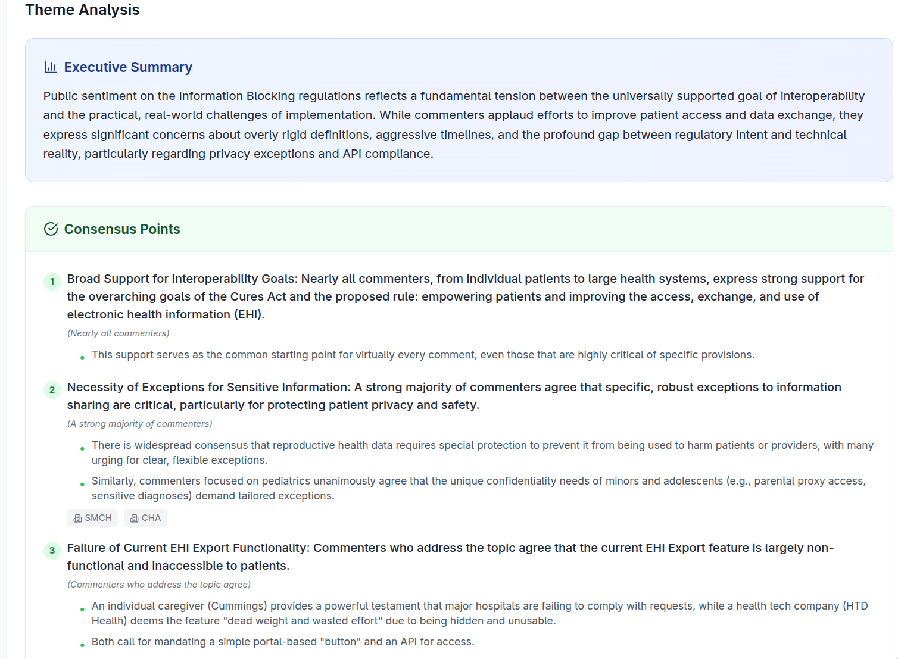

Created on 2025-06-16 18:52

Published on 2025-06-16 20:33

### Build a Tool

When the government asks for public comment on a new policy, it can get an overwhelming response. The recent CMS RFI on a "Digital Healthcare Ecosystem" is a case in point. The result is a pile of O(1000) submissions—a mix of metadata, attachments, and web form entries. The raw material is a heap of expressive, heterogenous text.

(Update: <https://www.linkedin.com/posts/josh-mandel_comment-analysis-dashboard-activity-7341513882902925312-47qi> -- first analysis of the CMS RFI comments is live.)

The best way to analyze this is to have a team of experts read everything. They'd highlight passages, categorize argumentative, and gradually build a mental model of the feedback. The process is high-quality, but it’s slow, expensive, and the results often end up in a static report or a massive spreadsheet that is difficult to query or share.

I wanted to see if I could build a tool that emulates the high-quality part of this process—the deep reading and thematic synthesis—but in a way that is automated, scalable, and produces a live, queryable artifact. The entire project is open-source.

Here’s how it works, step-by-step.

**1. First, you have to read everything.** Many of the most substantive comments are not in the web form, but in PDF attachments. So the first step is to download not just the comments but all their associated PDFs and run text extraction on them. This gives you the full, raw content to work with, just as a human analyst would need.

**2. Then, you automate the note-taking.** An analyst reading a comment would take notes, summarizing the author's position, their key requests, and their main worries. The pipeline automates this. For each comment, a language model reorganizes the original text into a standard template with sections like CORE POSITION, KEY RECOMMENDATIONS, and MAIN CONCERNS. The full text is preserved. To make this practical for thousands of comments, the process is parallelized to run many of these restructuring jobs at once.

**3. Next, you discover themes from the notes.** With a pile of standardized "notes," you can start to see the big picture. But as of June 2025, you can't straightforwardly feed O(1M) words of complex content into an LLM; the context window is too small, or model understanding degrades (this is an area of rapidly improvement, though). The solution is a hierarchical approach. I split the entire corpus into smaller batches. The model finds themes within each batch, resulting in several independent theme lists.

The interesting part is merging them. The pipeline treats it like a tournament bracket. It takes the theme list from batch 1 and 2 and tells the model to create a unified hierarchy. It does the same for batch 3 and 4 in parallel. Then it merges the results of those merges. This divide-and-conquer approach allows it to synthesize a single, coherent taxonomy from a massive amount of text.

**4. Then, you build the master spreadsheet (but better).** A manual analysis would end up with a giant spreadsheet mapping comments to themes. The pipeline automates the creation of this map. For every comment, a model scores its relevance against every single theme: (1) directly addresses it, (2) touches on it, or (3) doesn't address it. This produces a powerful relational index, far more flexible than a spreadsheet. You can now ask questions like, "Show me all comments from healthcare providers that strongly support theme 2.1."

**5. Finally, you write the reports.** After filling out their spreadsheet, an analyst would have to write a summary for each theme. The tool automates this too. For any given theme, it pulls all the comments that scored a 1 or 2 and feeds this curated text to a final prompt. This generates a narrative analysis identifying points of consensus, areas of debate, and noteworthy quotes.

**The result is a portable, static website.** The entire analysis—all the comments, themes, entities, and summaries—is compiled into a set of JSON files. A simple React application reads these files to create an interactive dashboard. There's no backend server, which makes it incredibly easy to host and share.

### Try a Live Demo

You can explore the interactive dashboard for this sample analysis here: [**https://joshuamandel.com/regulations.gov-comment-browser**](https://joshuamandel.com/regulations.gov-comment-browser/HHS-ONC-2024-0010-0001/)

Example of a Discovered Theme Hierarchy

This sample was processed with gemini-2.5-flash for a balance of speed and cost. A full analysis of the new CMS Health Tech Ecosystem RFI will follow once the comment period closes.

Example of a Theme-specific Analysis

### Run It Yourself

The project is on GitHub. If you're comfortable with the command line, you can run the whole thing. You'll need bun, and you'll need to get API keys from Google AI Studio and the regulations.gov developer portal. <https://github.com/jmandel/regulations.gov-comment-browser>

This is an experiment in applying structured data analysis to public discourse. The code is there to be used and improved. In particular, the current analysis pipeline is entirely feed-forward. Incorporation of agentic tool selection to search over raw comment data and formulate analyses on-the-fly (à la Deep [Re]Search) would be a very promising avenue for improvement.

#HealthIT #DigitalHealth #PublicPolicy #OpenSource #CMS #CivicTech #DataAnalysis #LLM