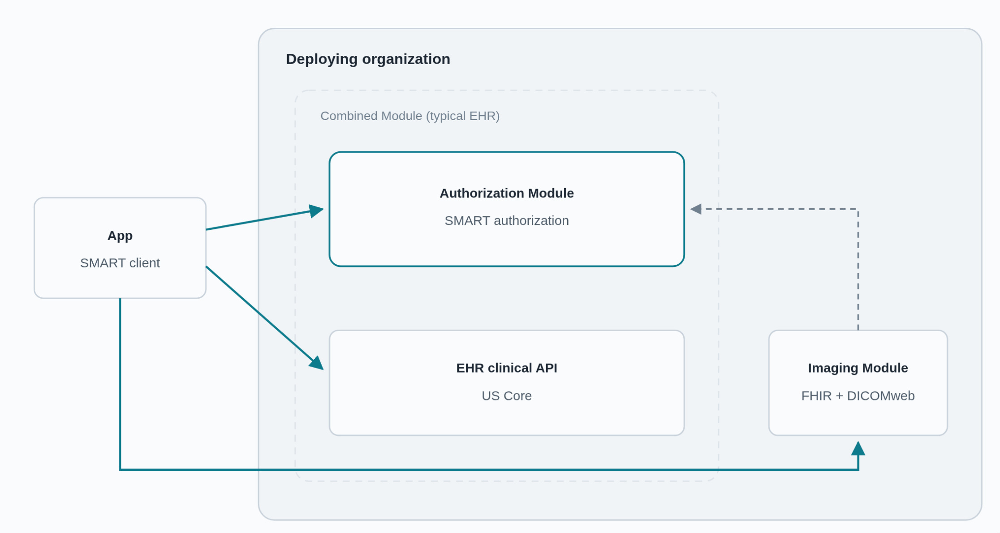
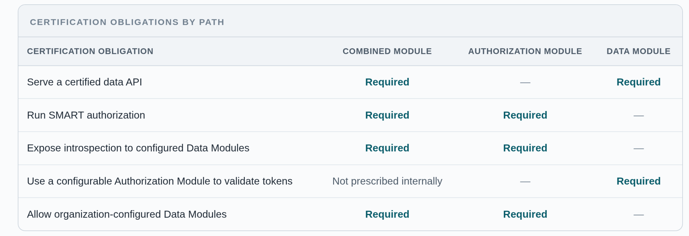

***TL;DR:*** *HTI-6 should split API certification into Authorization Modules (which manage SMART authorization), and Data Modules (which expose defined APIs).*

### "Imaging access" is getting urgent (but it's a special case of a general problem)

HHS has been thinking carefully about how to improve access to imaging data. ONC's [USCDI v7 and Standards Bulletin 26-2](https://healthit.gov/standards-and-technology/onc-standards-bulletin/onc-standards-bulletin-2026-2/) added a Diagnostic Imaging Reference, but noted that the reference alone does not ensure exchange from an external PACS. This year's [Diagnostic Imaging RFI](https://healthit.gov/standards-and-technology/request-for-information-diagnostic-imaging-interoperability-standards-and-certification/) asked whether PACS and vendor-neutral archives should be certified and whether imaging belongs in existing criteria or USCDI. And CMS's [Ditch the Disk](https://www.cms.gov/initiatives/health-technology-ecosystem/overview/early-adopters-all-pledgees/additional-use-case/additional-use-case-diagnostic-imaging-workgroup-ditch-disk) workgroup is pursuing FHIR ImagingStudy, DICOMweb, and SMART Imaging Access.

*Seamless access will require refactoring EHR certification*. If you try to retain-and-tweak the existing structure you reach dead ends:

* Duplicating the full (g)(10) criterion for PACS would make every imaging product run its own app-registration and authorization stack, forcing apps (and patients) through separate flows for clinical records and images.
* Adding imaging to USCDI would instead place the new obligation on EHR APIs even when a PACS holds and controls the images.

Imaging is an immediate use case, not the limit of my proposal. The same structure could support Data Modules implemented by genomics platforms, specialty-specific systems, document-management systems, and other clinical repositories that do not perform the full job of an EHR. Today, (g)(10) puts authorization and data-serving requirements in one certification package. Certification should define the two roles once, test the boundary between them, and let specialized products certify only the role they perform.

This proposal also provides a concrete instantiation of my [earlier appeal for modular authZ in HTI-6](/blog/posts/toward-modular-authz-in-hti-6-trusted-authorization-assertions). While eventually technology like SMART Permission Tickets can improve flexibility, we can make progress with established specs already adopted by ONC's certification program.

### Authorization Modules and Data Modules

HTI-6 should refactor (g)(10) into two separately certifiable roles. SMART already supports the interfaces, discovery, and cross-system connectivity to make this work:

* **Authorization Module** registers apps, runs SMART App Launch, captures consent, issues and refreshes tokens, handles revocation, and provides token introspection. It also lets the deploying organization attach or remove external Data Modules. Attachment causes the Authorization Module to publish the module through SMART discovery, authorize it as an introspection client, and enable the scopes configured for its API.
* **Data Module** exposes a defined API and enforces authorization from a configurable Authorization Module. It is certified for the data it serves, not for every data class or authorization function expected from an EHR. Two examples: 1) A **USCDI Data Module** serves the clinical data API required today through [FHIR US Core](https://hl7.org/fhir/us/core/); 2)An **Imaging Module**, as demonstrated by [SMART Imaging Access](https://build.fhir.org/ig/argonautproject/smart-imaging/), exposes ImagingStudy resources via FHIR and full content via DICOMweb.
* **Combined Module** includes an Authorization Module and a built-in Data Module that work closely together. The built-in Data Module may use private interfaces or shared internal state. Its Authorization Module is still a full Authorization Module: it must let the deploying organization attach external Data Modules through the standard cross-module contract.

For separate certification, each module would be tested against a reference implementation of the other role.

Solid lines show app traffic. The dashed line shows token introspection: organization-controlled configuration establishes the Imaging Module as an authorized client of the Authorization Module. A Combined Module may keep its internal boundary implem

### Certification paths

### Cross-module contract

Certification should leverage capabilities already defined in published SMART standards to establish a testable contract between modules:

* **Authorization Module - Attachment:** Let the organization attach or remove Data Modules. Attachment authorizes the module as an authenticated introspection client, publishes each approved location and its capabilities through associated\_endpoints, and enables its configured SMART v2 scopes. Removal withdraws the client authorization and discovery entries
* **Authorization Module Attachment - Token responses:** Include multi-server authorization\_details for attached modules in access-token and refresh responses, with locations, fhirVersions, and any location-specific scope, patient, encounter, or fhirContext.
* **Authorization Module Attachment - Introspection:** Return the effective location, scope, and context together with active, client\_id, exp, and fhirUser when applicable.
* **Data Module:** Publish SMART configuration pointing to the configured Authorization Module; introspect presented tokens; reject inactive tokens and tokens not valid for its location; and enforce the effective scope and patient context against its local records and restrictions.
* **Cross-module testing:** Attach a reference Data Module, discover it, obtain and use an authorized token, and verify location, scope, patient context, revocation, and removal across the boundary.

### What ONC can do

1. **Refactor** (g)(10) into separately certifiable Authorization Module and Data Module roles.
2. **Define distinct Data Module certifications** for the USCDI/US Core API, imaging, financial data, and additional domains. Each should test the API and data it serves without importing the full EHR certification stack.
3. **Put the cross-module contract into certification rules and tests**, including attachment and removal, SMART discovery, scopes, authorization\_details, introspection, and reference implementations for both sides.