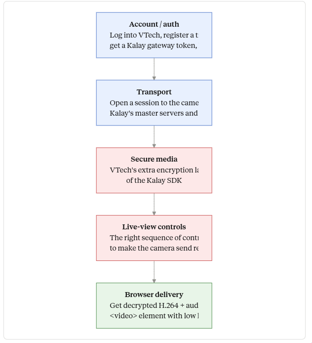
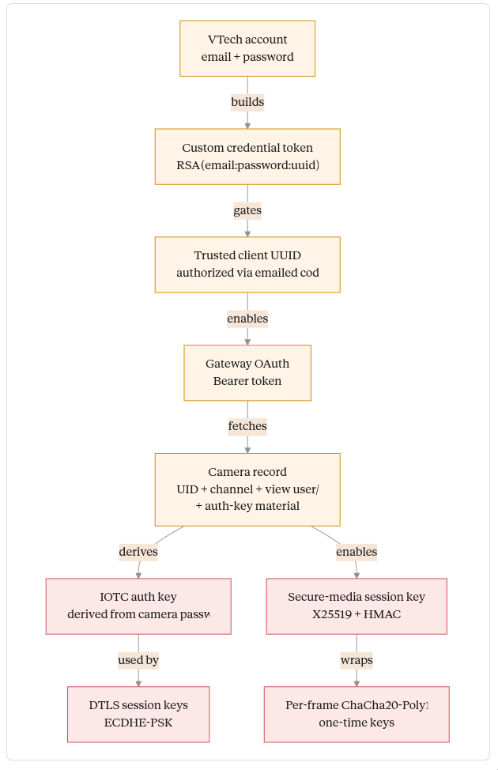
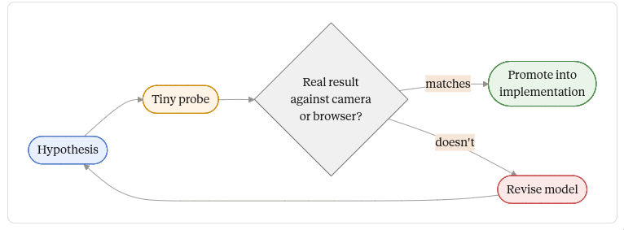

### The setup

I have a video baby monitor and a baby going through a "sleep regression". The camera works fine through the manufacturer's mobile app, but the app is awful as a long-running monitor: my phone has to stay open all night, runs hot, drains the battery, and gives me no way to pipe the feed into anything else. What I actually wanted was a tab in my browser. Live video, audio, pan/tilt controls, temperature, recent history — and ideally a foundation for some computer-vision experiments later (e.g., "is the baby standing up in the crib?").

This isn't a project I had time or expertise for. Reverse-engineering Android apps, hooking through emulator anti-tamper traps, instrumenting native instructions, and reading SDK internals all take significant time investment. And I'm not very familiar with streaming protocols — H.264 packetization, DTLS over UDP, HLS segment timing.

GPT-5.5 had just shipped, with OpenAI claiming meaningful improvements on long-horizon engineering inside Codex CLI: holding context across large codebases, using tools, checking its own assumptions, testing, and propagating changes through surrounding code. I set the model to xhigh thinking effort and gave it this project as a stress test. Could it carry a multi-domain reverse engineering effort from "no idea" to "working browser monitor" with me mostly along for the ride?

The short answer is yes, and the rest of this post is a tour of how it got there.

### Why this is hard

When you connect to the "smart" camera, you don't get a normal video URL or web-accessible feed. Instead, the camera works through a third-party SDK called Kalay (formerly TUTK), made by a company called ThroughTek. Lots of consumer cameras use it.

The flow is roughly: when you open the mobile app, it logs into your account, gets authorized as a trusted client, and asks a cloud "gateway" for the list of cameras on your account. The gateway returns connection material — a camera ID, view credentials, an authentication key — but no IP address or stream URL. The app then uses Kalay's SDK to broker a session to the camera through Kalay's servers (or directly, when you're on the same Wi-Fi), negotiates encryption, and starts receiving encrypted video and audio frames, which it decrypts and decodes locally. To get a browser monitor, all of that has to happen from a local server I write, without the mobile app in the loop.

None of it is documented in the way you'd want. ThroughTek publishes some general documentation, but the specifics of how the camera uses the SDK — the account flow, the cloud gateway protocol, how the camera credentials become a connection, what extra encryption added on top of Kalay's, what control commands actually produce a watchable stream — live inside the Android app, which is obfuscated.

So the project naturally splits into layers: the account/auth layer (what HTTP calls does the app make to whom?), the transport layer (how does the SDK actually move bytes between you and the camera?), the secure-media layer (what does the camera do on top of TUTK?), the live-view layer (what control commands turn the stream from a slideshow into real video?), and the browser delivery layer (how does that video get into a <video> element with low latency?). Each has its own techniques and its own ways of being verified.

### Reading the app

The first thing GPT-5.5 had to do was figure out the layout. An Android app ships as an .apk file — a zip archive of compiled bytecode (in .dex files), native libraries (.so files; ARM64 in this case), and resources. To understand what an app does, you decompile the .dex files back into something resembling Java with a tool called JADX, and then you grep through it.

This app doesn't make that easy. It uses heavy obfuscation — class and method names renamed to gibberish like o.onDetach, arithmetic traps that crash on emulators — and, crucially, its real code isn't in the .dex files you start with. It uses *dynamic dex loading*: at startup, the visible code decrypts two embedded payloads (a- and b-), which are themselves zipped .dex files, and loads them into memory. The HTTP wrapper, the account API client, and the camera bridge classes only exist after that runtime step.

GPT-5.5's first strategic decision was correct: rather than try to run the obfuscated app under a debugger or instrumentation framework (every emulator attempt hit a startup trap), it found the loader code, recovered the encrypted payloads, decrypted them offline, and unzipped the second-stage .dex files into something readable. From there it could see the real account endpoints, the real HTTP wrapper, and the real camera bridge code. Watching this happen, I had to slow down and ask it to explain dynamic dex loading and why finding the second stage offline was easier than fighting the runtime — but once it explained, the move was obviously right.

### The account flow

With the recovered code visible, GPT-5.5 mapped the account flow. The mobile app talks to three different services: an account which handles login and 2FA; a Kalay gateway at vsaas-gateway.kalayservice.com, which holds the camera metadata; and a separate endpoint for some adjacent things.

Login is more interesting than it first looks. You don't just send a username and password. You also send a "client UUID" representing this particular phone or app install, and the API will refuse to give you any camera data until that UUID has been authorized via a code emailed to the user. The authorization is gated on a "Custom" credential header — a token built by RSA-encrypting email:base64(password):uuid with a public key baked into the app. After authorization, that same token unlocks an endpoint called /api/v2/account/devices, which sounds like the camera list but is actually the list of *trusted phones and clients* — Pixel-this and Pixel-that, plus the synthetic local "client" that GPT-5.5 had registered for our use.

The actual cameras live on the Kalay gateway, behind an OAuth flow. The model worked out the dance — start the OAuth, get redirected to a login form (which requires browser-style fingerprint fields; omitting them returns 500), receive a callback URL with a code, exchange the code for a Bearer token — and used the token to hit /api/v1/devices/, which finally returns the camera. The camera record contains a UID, a channel number, and per-camera view credentials that are *not* the user's account password.

Watching this happen, the thing that struck me was how many similar-sounding objects had to be kept distinct: account, trusted app client, gateway OAuth token, camera metadata, AV credentials, IOTC auth key. These are all "credentials" of one form or another, with confusingly overlapping purposes, and a lot of the slow bug-finding in this kind of project is failing to keep them straight. GPT-5.5 didn't, and that alone saved hours.

### The Android oracle

Now we have credentials and a camera UID. We need to actually open a stream. The transport is implemented by ThroughTek's native libraries (libIOTCAPIs.so, libAVAPIs.so, libTUTKGlobalAPIs.so), shipped inside the APK. These are ARM64 Android binaries — they cannot be loaded by my x86\_64 Linux server.

The problem is "we know which calls to make, but we can't make them from our server, because the libraries don't run there." The model's solution was elegant. Android lets you start a small Java program from the command line with a tool called app\_process64, which spins up a minimal JVM with system access. GPT-5.5 wrote a tiny Java "oracle" — a sidecar program that runs on my phone via ADB (Android Debug Bridge, the standard wired/wireless dev connection), loads the APK's own native libraries, and calls the SDK functions on demand: connect, authenticate, send a control message, receive a frame. Driven from my laptop. Logged through ADB.

This worked on the first real run. The oracle connected, authenticated, started the AV session, sent the standard "start video" and "start audio" control messages, and received valid H.264 video frames. GPT-5.5 ran ffprobe (a stream inspection tool) on the captured bytes to confirm the encoding, then decoded the first frame to a JPEG to look at it.

The first frame was a placeholder image saying "security protocol changed; please update the app." Real bytes, real H.264, but not the nursery. That was actually a clean result — it told us transport was working, but this camera had an additional unlock layer on top of the base SDK.

### Secure media

Reading the recovered app code more carefully, GPT-5.5 found a second handshake that runs after the standard SDK connection. In plain language:

You ask the camera for its device info. It sends back a structure with model and vendor strings, plus a flag indicating whether secure media is enabled. If it is, you generate an X25519 key pair (X25519 is a modern elliptic-curve key agreement: both sides exchange public keys, both compute the same shared secret, and the secret never crosses the wire). You send the camera your public key in a control message. It replies with its public key and a salt. You compute the shared secret, then run it through HMAC-SHA256 with the salt to derive a per-session media key.

After that, every encrypted AV frame arrives in a fixed layout: 32 bytes of "encrypted one-time frame key," then a 12-byte nonce, then a 16-byte authentication tag, then ciphertext. You decrypt the one-time key with the media key, then use it to decrypt the actual frame using ChaCha20-Poly1305 (a widely used authenticated cipher). The result, when correct, is a normal Annex-B H.264 byte stream — the same format any video decoder expects, recognizable by the four-byte 00 00 00 01 start code between frames.

GPT-5.5 ported the whole thing into TypeScript: X25519 key agreement, the HMAC key derivation, the per-frame ChaCha20-Poly1305 decrypt. It validated the port by feeding captured frames through it and watching for the 00 00 00 01 prefix. The first decoded frame after the port was real video of the nursery.

I want to flag what's hard here. None of these primitives are exotic — X25519, HMAC-SHA256, ChaCha20-Poly1305 are standard and well-documented. The challenge wasn't *implementing* the crypto, it was discovering what specific layout bolted onto Kalay, in what order, with what byte offsets, and validating each guess. This is exactly the kind of work where one wrong byte produces silent garbage, and the only way to know you have it right is to validate against the live camera.

### Going phone-free

We could now decrypt camera video, but the Android oracle was still on the path — my laptop talked to the phone, and the phone talked to the camera. The next step was to remove the phone entirely and have my server talk to the camera directly. That meant reimplementing the Kalay transport itself in TypeScript.

The local network case is easy. The Kalay SDK announces itself with a UDP broadcast on port 32762, and the camera replies from its current local endpoint. GPT-5.5 reproduced the exact 88-byte discovery packet in TypeScript, broadcast it, and got the reply, learning the camera's IP and port dynamically — no hardcoding, works after a DHCP lease change.

Remote was much harder, because the camera reaches in through Kalay's "master" servers and public relays, and the relevant work happens deep inside compiled C code. To map this protocol from outside, GPT-5.5 used the cleanest tool in the project, which is worth dwelling on.

It built two small shared libraries that get loaded into the oracle process via LD\_PRELOAD. LD\_PRELOAD is a Linux/Android mechanism that lets you intercept calls to library functions before the program reaches them — your library is loaded first, and when the program calls connect() or sendto() or recv(), your version runs first, can log what's happening, and then forwards the call. It's effectively a wiretap on a process you don't have source for.

The first shim logged every networking syscall the SDK made: DNS lookups, UDP packet sizes and prefixes, the specific endpoints the SDK was probing. The second shim logged the boundaries of selected encryption functions — keys, IVs, additional authenticated data — so the model could see what was being encrypted with what, without printing my actual camera secrets. Between them, the entire remote protocol became visible.

The SDK looked up all-c-master-...iotcplatform.com, sent a stable 268-byte packet starting with the prefix 51 cc to UDP port 10240, and got back 450-byte replies. The 268-byte packet was an RSA-encrypted record (with the public key embedded in libIOTCAPIs.so). The replies were AES-128-GCM, with the key and IV derived from material in the request itself. Inside the decrypted reply was a list of public relay candidates, each tagged with its IP, port, and a P-256 elliptic-curve public key.

The model then mapped the relay setup itself: probe commands 0x8003/0x8004, then a P-256 ECDH key exchange wrapped in further AES-GCM (0x0201/0x0301/0x0401), then a session "code" message that triggers a custom DTLS handshake, then encrypted AV/control messages flowing inside the DTLS tunnel.

DTLS is "Datagram TLS" — TLS, but over UDP. The version Kalay uses is mostly standard with quirks: a specific cipher suite called TLS\_ECDHE\_PSK\_WITH\_CHACHA20\_POLY1305\_SHA256, a pre-shared key derived from the camera password, and a particular treatment of the Extended Master Secret extension. GPT-5.5 implemented the whole handshake from scratch in TypeScript — premaster secret derivation, master secret with EMS, AEAD record protection — and validated it by checking that the server's "Finished" message verified correctly with the keys it had derived.

When that worked, my server could open a relay to the camera from anywhere on the internet, finish DTLS, run the AV login inside, do the secure-media handshake, and receive decrypted H.264. No phone in the loop.

This is the layer where, watching, I had the strongest "I would not be doing this myself, ever" reaction. The model was reading native ARM64 disassembly to find where the master packet was constructed, identifying a function called iotcRecordSendMasterHandshake, locating the embedded RSA public key by file offset, then verifying its TypeScript implementation produced byte-for-byte the same output as the live captured packet. It also took several wrong turns. One memorable one: in the relay state machine, a peer-check ACK has a result field, and the model first guessed it should be 0 for success. Pointing at the captured stock-app sequence revealed it should be 1. Until that one bit was right, the relay would never send the session code, and the next layer never started. That kind of bug is the typical shape of this work.

### The 1 fps trap

The first real video over the pure TypeScript path arrived, but at the wrong profile: 640×360, roughly one frame per second, every frame a keyframe, with audio. This wasn't browser latency or transport latency — the camera was *sending* a slideshow.

GPT-5.5 first tried the obvious: the public Kalay command for setting stream quality (SETSTREAMCTRL). The camera politely returned the current quality and refused to change it for any value. So the model went back to the recovered app code, traced the call graph from the live-view UI activity, and noticed that the production app sends a longer sequence of control messages before starting video — a "preamble" with camer-specific commands for support-stream discovery, timezone/options, RM-series parameters, and several other controls. The model reproduced the preamble. The stream flipped to 1280×720 at 10 fps with proper inter-frame coding (I- and P-frames, short GOP). G.711A audio came along for free.

This was the real quality unlock, and it's a good example of why this work has to be grounded in evidence. A plausible hypothesis ("just set quality to 1080p") would have stayed plausible forever; only running it against the actual camera and watching it fail proved otherwise.

### Browser delivery

Once decrypted H.264 video and G.711A audio existed reliably on my server, the browser side was relatively standard media engineering, and GPT-5.5 leaned more on public documentation here — FFmpeg's HLS muxer docs, hls.js's live-sync settings, MDN for WebCodecs, the relevant RFCs for H.264 over RTP and WebRTC's AVC packetization rules.

Three delivery paths got built. **HLS** (HTTP Live Streaming) is a simple format where the server writes short MPEG-TS segments and a playlist of recent ones, and the browser pulls them. It's robust and great for history (you can keep segments around and let the browser seek through them), but it has an inherent latency floor because segments only finish at keyframe boundaries. The first version had ~10s lag because the camera's keyframe interval made segments much longer than intended. The fix was a live transcode: re-encode to one-second GOPs and one-second segments with libx264 -tune zerolatency, which dropped HLS lag to 1–2 seconds. HLS stayed as the path for recorded history.

**WebCodecs** is a newer browser API that gives you a VideoDecoder you can feed raw H.264 access units into. Lower latency than HLS because there's no segmenting — you push frames over a WebSocket and decode them immediately. The implementation pushes the H.264 SPS (the parameter set that describes the codec configuration) as a config message, then a cached IDR snapshot (so a reload shows a frame instantly instead of waiting up to one keyframe interval), then live access units. A small jitter buffer in the browser smooths uneven packet arrival.

**WebRTC** is the lowest-latency option and ended up being the default live path. It packetizes H.264 into RTP with packetization-mode 1 and FU-A fragmentation (the standard way to split a large video frame across UDP packets), and PCMA audio at 8 kHz. The browser handles decoding natively. GPT-5.5 used a TypeScript WebRTC implementation called werift to avoid spawning external processes.

A bunch of secondary work came after: pan/tilt commands (the standard Kalay PTZ command at command 0x1001, but only working above a certain speed because the motors have a deadband — the model wrote a frame-difference diagnostic to find the threshold autonomously); temperature telemetry decoded from app params (with one entertainingly misleading byte that looked like it meant "video codec 78" but actually meant 78°F); gap-aware history seeking that handles holes in the recorded segment timeline; fullscreen and keyboard controls; a small computer-vision experiment for "is the baby in the crib" (verdict: open-vocabulary models find the crib easily but not the baby).

### What the model actually did, autonomously

**It read prior work.** It found and read the public ThroughTek IOCTRL documentation, ThroughTek's VSaaS docs, ThroughTek's Kalay sample app on GitHub, the open-source wyzecam Python wrapper (which uses the same TUTK SDK shape for Wyze cameras), and go2rtc's TUTK code (which has a related but not identical DTLS implementation). It read FFmpeg's HLS muxer docs, hls.js's latency-tuning options, MDN for WebCodecs, and the relevant RFCs for H.264 over RTP. When the public docs were sufficient, it used them. When they fell short, it noted where they fell short and switched to reverse engineering.

**It built diagnostic tools.** The most-used files in the repo turned out to be the probes: the Android oracle, the network syscall shim, the crypto tracing shim, a master-packet analyzer, a relay candidate probe, DTLS tests, secure-media unit tests, an H.264 NAL-unit analyzer, a PTZ frame-difference diagnostic, browser-latency measurement scripts, Playwright scripts that drove the actual UI in headless Chromium and asserted on readyState and dimensions. Each turned a vague failure ("no video in the browser") into something inspectable ("zero H.264 bytes flowing into FFmpeg," or "frames flowing but videoWidth=0," or "DTLS server flight verifies but the next packet has the wrong sequence number").

**It managed long context across very different domains.** Over the project, the model worked across: Android reverse engineering, native ARM64 disassembly, RSA without padding, AES-GCM with non-obvious key derivation, X25519, ChaCha20-Poly1305, a custom DTLS handshake, H.264 packetization, FFmpeg pipelines, hls.js latency tuning, WebCodecs and WebRTC, React UI, Playwright validation, an LD\_PRELOAD shim written in C, and an Android app\_process64 sidecar in Java. It kept the namespaces straight (a dozen credential-like objects with overlapping names) and kept its corrections in scope.

### Could a smart human have skipped some of this?

In retrospect, partly. The generic Kalay/TUTK call order, the common command IDs (start video, start audio, audio format, PTZ, device info), the H.264 codec ID, the G.711A audio codec ID, the OAuth/Bearer/refresh-token vocabulary on the gateway side, and HLS latency mechanics were all knowable from public ThroughTek docs and open-source projects. A faster start would have been: read the manuals, read the ThroughTek docs, read wyzecam, read go2rtc, then go reverse-engineer the camera-specific gaps.

But the decisive blockers — the 2FA/trusted-client flow, the OAuth specifics, the per-camera auth-key derivation, the secure-media X25519/ChaCha20-Poly1305 layer, the modern Kalay master/relay crypto, and the live-view preamble — were not in the public sources. Those needed reverse engineering, and most of the project's time was spent there.

### Result and reflection

In my college days I might have spent two weeks on a project of this scope.

I have a local browser monitor. WebRTC by default at 1280×720 / 10 fps with G.711A audio, sub-second to roughly two-second latency depending on path. WebCodecs and HLS as fallbacks. HLS-recorded history with gap-aware seeking through retained segments. PTZ, temperature, keyboard shortcuts, fullscreen, a clean React UI. It runs locally as a Bun server. No phone app.

This experiment showed GPT-5.5 can reverse engineer with great success if you give it the ability to run probes, validate against ground truth, and revise. It identifies when public documentation is enough versus when it has to read source. It builds the diagnostic infrastructure that makes hard problems debuggable rather than only writing code that hopes to work.