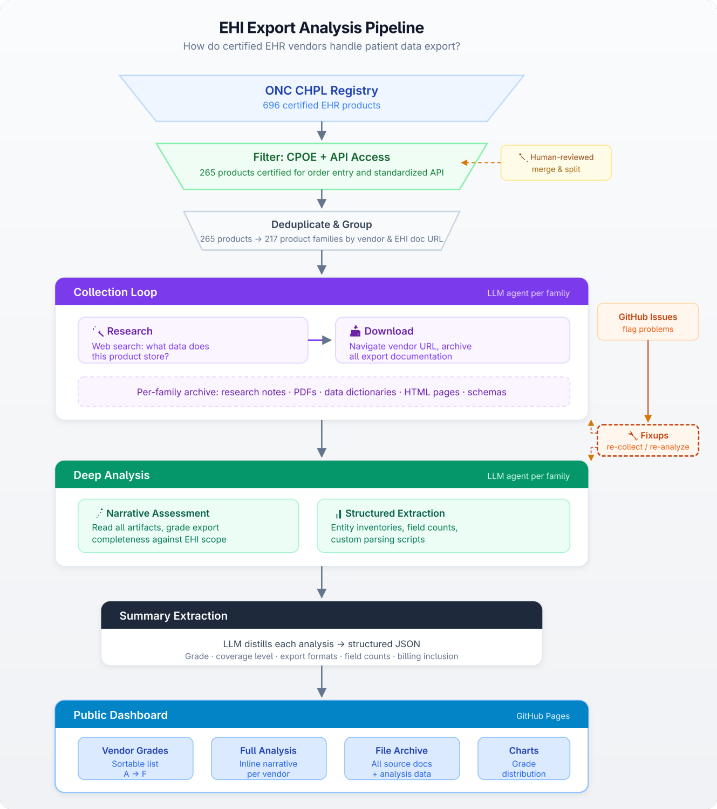
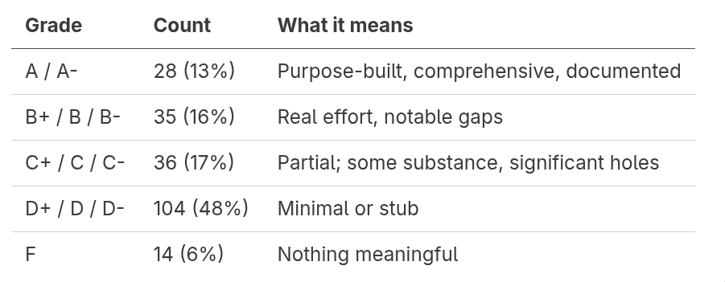

*A caveat up front: Evaluating EHI export documentation is hard. Vendors' published specs are often limited, cryptic, or use product-specific terminology that's unfamiliar even to domain experts. AI-assisted analysis facilitates best-effort understanding, but it can be wrong in the details. I can't manually review all 600K words of product research, 800K words of notes from navigating vendor sites to find EHI docs, 600K words of per-vendor analysis, or 80K lines of code to parse and process documentation in service of that analysis -- but I've spot-checked the claims highlighted in this article. If any assessment is in error, I'd welcome your corrections: please* [*file an issue*](https://github.com/jmandel/ehi-export-analysis/issues/new) *or* [*message me on LinkedIn*](https://www.linkedin.com/in/josh-mandel/)*.*

Under the [21st Century Cures Act](https://www.congress.gov/bill/114th-congress/house-bill/34/text/pl) and [its implementing regulations from HHS](https://www.healthit.gov/topic/laws-regulation-and-policy/health-it-legislation-and-regulations), every certified EHR must be able to export **all** of a patient's electronic health information (["(b)(10)"](https://www.healthit.gov/test-method/electronic-health-information-export) is the shorthand). Everything the system stores, in a computable format, with public documentation describing what the export contains. I examined the published (b)(10) documentation for 265 certified EHR products, grouped into 217 product families. Over half describe nothing more than a relabeled clinical summary.

### Why this matters more than it used to

Clinical summaries have always been lossy by design. A C-CDA or FHIR US Core document captures the highlights: the problem list, the med list, the recent labs. That's genuinely useful for provider-to-provider handoffs and population health queries. But the use cases emerging now need more than highlights.

Consider:

* **Surprise billing.** A patient trying to understand a surprise medical bill needs the actual charge detail, claim submissions, and denial history -- data that has no representation in any standard clinical exchange format.
* **Cancer navigation.** An AI agent helping a patient navigate a complex cancer diagnosis needs the oncology staging data, the chemo regimen details, the radiation treatment plans, not just "Condition: malignant neoplasm of breast" on a problem list.
* **Longitudinal AI assistance.** An AI health assistant reviewing a patient's history needs the portal message threads where the patient reported worsening side effects and the doctor adjusted the treatment plan; those conversations are part of the clinical narrative but vanish from a standard summary.

These use cases all build on the same legal foundation: the patient's right under HIPAA to access their [Designated Record Set](https://www.ecfr.gov/current/title-45/subtitle-A/subchapter-C/part-164/subpart-E/section-164.501), which (b)(10) requires certified EHRs to export in computable form. The regulation was written before the current AI moment, but it defines what goes in the box that AI agents, personal health applications, and other downstream consumers need: a patient's *whole* record, not just the summary. This post examines what vendors are putting in the box. A separate question (how patients actually get it delivered!) matters too, and I'll return to it in recommendations when we wrap up.

### What I did

Over 600 certified health IT products attest to (b)(10). ONC maintains a public registry of these products (the [Certified Health IT Product List](https://chpl.healthit.gov/), or CHPL) where each one posts a URL to its export format documentation. Many of those 600+ are narrow-scope modules: a standalone patient portal, a quality measure calculation engine, an API adapter. To focus on products that function as fairly complete EHRs, I filtered for those also certified for CPOE [(a)(1)–(a)(3)](https://www.healthit.gov/test-method/computerized-provider-order-entry-cpoe-medications) and the standardized FHIR API [(g)(10)](https://www.healthit.gov/test-method/standardized-api-patient-and-population-services), a rough proxy for a typical clinical capability set.

That leaves 265 CHPL-certified products, which I grouped into 217 product families. (Products sharing an EHI documentation URL and developer are one family; MEDITECH Expanse 2.1 and 2.2 are a single family; MEDITECH Expanse and MEDITECH Client/Server are different families because they have different export architectures.)

*The full pipeline: CHPL registry → filter and deduplicate → phased collection → deep analysis → structured summary → public dashboard.*

For each family, an AI agent researched the vendor and product, then navigated to the registered documentation URL and downloaded everything it found: PDFs, HTML pages, data dictionaries, schema files. A separate agent then performed a deep analysis: what does the export actually contain? How does it compare to what the product stores? Is this a genuine EHI export or a relabeled clinical summary?

Everything is open source. The [dashboard](https://joshuamandel.com/ehi-export-analysis/) has the full results; the [repository](https://github.com/jmandel/ehi-export-analysis) has the methodology, prompts, and raw data.

*To be clear: I evaluated documentation, not actual export files. Publishing documentation is an obligation for certified EHRs. Actually requesting and receiving a (b)(10) export remains difficult in practice; most require a manual request to the health system, often with weeks of turnaround. When this post says an export "includes" or "omits" something, it means the vendor's published documentation does or doesn't describe it. Some vendors may export more than they document, but the point of the (b)(10) documentation requirement is that patients and developers can assess an export's contents without running it. If it's not documented, it doesn't exist for accountability purposes.*

### 217 product families, graded

Over half of the EHR products analyzed (products certified by ONC, attesting to a federal requirement, serving real patients) have (b)(10) export documentation that either describes what amounts to a clinical summary relabeled as "all EHI" or is too thin to evaluate at all.

The most common single grade is a plain D, at 58 products (27%). These are the textbook cases: a C-CDA clinical summary or (g)(10) FHIR API relabeled as the (b)(10) export, with no data dictionary, no specialty data, and usually no billing.

### Billing as litmus test

Almost every EHR in this cohort handles billing: charge capture, claim submission, payment posting, denial management. Billing data is squarely part of the Designated Record Set. And it has no representation in C-CDA or USCDI: there's no C-CDA template for a superbill, no US Core profile for a claim denial.

So billing is a natural litmus test. If a vendor's documentation describes billing data in the export, they built something beyond their existing clinical exchange infrastructure. If it doesn't, they probably relabeled what they already had.

Of the 190 products in this cohort that handle billing, **100 (53%) do not document its inclusion in their export**. This is data the product stores, data that's part of the patient's legal record, data that patients increasingly need for dispute resolution and financial planning, and data that simply cannot be delivered through existing clinical exchange formats. Its absence from the documentation is the clearest signal that an export was not purpose-built.

### Billing data are substantial, when they exist!

Billing often turns out to be the single largest domain in the entire export:

* [**Epic**](https://joshuamandel.com/ehi-export-analysis#vendor/epic-systems-corporation--epic-ehr) exports 1,286 billing and revenue cycle tables with 12,367 columns. This single domain exceeds most vendors' *entire* exports.
* [**Altera Sunrise**](https://joshuamandel.com/ehi-export-analysis#vendor/altera-digital-health-inc--altera-sunrise) dedicates 917 tables to billing, 33% of everything in the export.
* [**Greenway Prime Suite**](https://joshuamandel.com/ehi-export-analysis#vendor/greenway-health-llc--greenway-prime-suite) includes 192 billing tables. Their CFBClaimInfo table has 435 fields, the single largest entity in the export.
* [**eClinicalWorks**](https://joshuamandel.com/ehi-export-analysis#vendor/eclinicalworks-llc--eclinicalworks) exports 161 billing tables, including state-specific Medicaid claim forms: a NY Workers' Comp C-4.3 at 218 fields, a UB-04 institutional claim at 127 fields.
* [**Juno Health**](https://joshuamandel.com/ehi-export-analysis#vendor/juno-health--juno-ehr): the three largest tables in the entire export are all billing. RCMUB04CLAIM (260 fields mapping every box on the UB-04 form), RCM1500CLAIM (116 fields), BILLINGITEM (115 fields).

Smaller vendors get this right too. [MDVita](https://joshuamandel.com/ehi-export-analysis#vendor/health-care-2000-inc--mdvita) (24 entities total) is a claims-adjudication company turned EHR vendor; their Claims entity has 85 fields with granular EOB data. [athenahealth](https://joshuamandel.com/ehi-export-analysis#vendor/athenahealth-inc--athenaclinicals) defined 9 custom FHIR resource types specifically for billing (506 fields including charges, collections, eligibility, and payment plans), proving you can do this in FHIR if you actually do the mapping work.

And sometimes the irony is hard to miss:

* [**MaxRemind (Maximus EHR)**](https://joshuamandel.com/ehi-export-analysis#vendor/maxremind-inc--maximus): a billing company's EHR. Export docs: repackaged (g)(10) FHIR plus two undocumented Excel files. No indication of billing data.
* [**ClaimPower**](https://joshuamandel.com/ehi-export-analysis#vendor/claimpower-inc--claimpower-mobile-emr): the company name says it. Export docs: C-CDA clinical summary, 502 words of screenshot walkthroughs. No indication of claims or payment data.
* [**Radysans**](https://joshuamandel.com/ehi-export-analysis#vendor/radysans-inc--radysans-ehr): full eBilling module with 2,500+ payer connections. Export docs indicate no billing data.

### Specialty EHRs and their specialty data

Specialty EHRs are where the stakes are clearest. These products exist to capture domain-specific clinical data, and some vendors export it beautifully.

[**ModMed's gGastro**](https://joshuamandel.com/ehi-export-analysis#vendor/modernizing-medicine-gastroenterology-llc--ggastro) (GI/endoscopy) has a Finding table with 155 fields per endoscopic finding: polyp size, morphology, location, removal method, EUS staging, Barrett's esophagus measurements. The export also covers GI-specific quality registries (GIQuIC colonoscopy quality, AGA registry) and IBD disease tracking with Montreal Classification and HBI scoring.

[**ModMed's EMA**](https://joshuamandel.com/ehi-export-analysis#vendor/modernizing-medicine-inc--ema) (ophthalmology) exports 25 pretesting tables with fields like near\_point\_conv\_blur, near\_point\_conv\_break, near\_point\_conv\_recover (the full binocular vision workup), plus per-eye diagnostic drop tracking (tropicamide\_1\_phenylephrine\_2\_5\_od), color vision plate-by-plate results, and cover test data across 9 gaze positions.

[**nAbleMD**](https://joshuamandel.com/ehi-export-analysis#vendor/nth-technologies-inc--nablemd) (fertility/IVF) exports 30 IVF-specific entities. A single emrcycle table tracks a treatment cycle in 231 fields from egg source through stimulation, retrieval, ICSI, culture, and transfer, down to catheter depth and whether there was mucus in the sheath. The embryology tables grade each oocyte on inner cell mass, zona pellucida, fragmentation, and multinucleation. There are fields for TMRW robotic cryostorage barcodes, SCSA sperm DNA fragmentation scores, and donor phenotyping (RomanNose, dimples, CleftChin).

[**Flatiron OncoEMR**](https://joshuamandel.com/ehi-export-analysis#vendor/flatiron-health--oncoemr) has a DoseCalculationHistory table that models the full pharmacology pipeline: BSA calculation, AUC/carboplatin dosing from creatinine clearance, then the dose cascade from regimen value through adjustment percentage to final rounded dose. It tracks AJCC staging with clinical vs. pathologic differentiation, treatment pathway concordance against NCCN guidelines, and lifetime cumulative drug exposure for agents with toxicity limits.

These vendors looked at what their products actually capture and built exports that cover it.

Not every specialty vendor did the work.

[**EndoVault**](https://joshuamandel.com/ehi-export-analysis#vendor/endosoft-llc--endovault) (also endoscopy/GI): stores HD images, 4K video, bowel prep scores, polyp characteristics, scope tracking via RFID. The export documentation mentions no endoscopy-specific content.

[**EyeMD**](https://joshuamandel.com/ehi-export-analysis#vendor/eyemd-emr-healthcare-systems-inc--eyemd-electronic-medical-records) (also ophthalmology): 2024 Best in KLAS winner. Integrates Zeiss, Heidelberg, and Topcon imaging devices. Export documentation describes 25 standard FHIR resources with no mention of ophthalmology-specific data.

[**ARIA CORE**](https://joshuamandel.com/ehi-export-analysis#vendor/varian-medical-systems--aria-core) (radiation oncology, Varian/Siemens): the dominant US radiation oncology system. Registered EHI documentation URL returns 404. It has never been captured by the Wayback Machine.

The specialty data exists in all of these systems; it's what they're built to capture. The difference is whether the vendor did the work.

### What does "credible" look like?

***If a product has thousands of fields driving its UI, its clinical decision support, and its specialty workflows, and the documented export offers only a fraction of them, that's not a credible EHI Export.***

Twenty-eight product families earned an A or A-. They span from the largest EHR vendors to solo developers. These vendors looked at what their products actually store and built exports that cover it (as the regulation requires). A few examples:

* [**Oracle Health (Millennium)**](https://joshuamandel.com/ehi-export-analysis#vendor/oracle-health--oracle-health-millennium-clinical): 6,853 tables, 130,853 columns, 99.9% description coverage, three complementary export pathways. The gold standard for documentation depth.
* [**Epic**](https://joshuamandel.com/ehi-export-analysis#vendor/epic-systems-corporation--epic-ehr): 7,672 tables, 63,121 columns, 100% descriptions. The Clarity data model exported as TSV with full field documentation.
* [**eClinicalWorks**](https://joshuamandel.com/ehi-export-analysis#vendor/eclinicalworks-llc--eclinicalworks): 1,466 tables, 21,143 fields. Billing at 161 tables, clinical at 350+.
* [**Greenway Prime Suite**](https://joshuamandel.com/ehi-export-analysis#vendor/greenway-health-llc--greenway-prime-suite): 1,026 tables, 11,868 fields.
* [**athenahealth**](https://joshuamandel.com/ehi-export-analysis#vendor/athenahealth-inc--athenaclinicals): a purpose-built FHIR export with 9 custom financial resource types, proving you can do this in FHIR if you invest in the mapping.
* [**Crystal Practice Management**](https://joshuamandel.com/ehi-export-analysis#vendor/abeo-solutions-inc--crystal-practice-management) (ABEO, 80 entities): a small ENT vendor with a 921-page data dictionary. 58 tables covering clinical, billing, VSP insurance, and ophthalmology supply chain. Size doesn't determine effort.
* [**OpenEMR**](https://joshuamandel.com/ehi-export-analysis#vendor/openemr-foundation--openemr): 322 entities, 4,941 fields. Community-maintained, open-source, and more thoroughly documented than most commercial vendors.

### So now what

Based on these findings, a few recommendations, organized by audience.

**ASTP / ONC**

1. **Preserve Real World Testing requirements for (b)(10).** The proposed rollback in HTI-5 would eliminate one of the few mechanisms that provides any visibility into whether EHI exports are functioning in practice.
2. **Require a patient-facing EHI export API in HTI-6.** Even when vendors pack the box properly, there's no reliable delivery system. Most (b)(10) exports require a manual request to the health system, often with weeks of turnaround -- the equivalent of asking patients to drive to the warehouse and pick it up themselves. The (g)(10) standardized API already delivers USCDI data through SMART on FHIR. Extending that infrastructure with a full-EHI scope (same authorization, same app ecosystem, broader data, no deep standards/consensus required) would create a delivery channel. That matters because automated delivery creates accountability: when any patient-authorized app can request an export and inspect what arrives, it becomes visible whether the export is incomplete, undocumented, or disorganized beyond practical use.
3. **Leverage existing oversight tools to drive change.** ONC-ACBs can conduct in-the-field surveillance of certified products and request documentation from developers as part of ongoing certification maintenance. ONC itself can directly review any certified product when there's reason to believe it isn't meeting certification requirements. Today, the only real feedback loop is a patient requesting their records, waiting weeks, receiving an export, and having the technical sophistication to realize it's a relabeled clinical summary, then figuring out where to complain. That loop is too long, too rare, and too quiet to drive change.
4. **Require actual testing.** Today, (b)(10) conformance is attestation-based: vendors attest, ONC-ACBs review the attestation, but nobody runs a test export and checks what comes out. The extreme variability in what vendors publish at their documentation URLs suggests attestation alone isn't producing consistent outcomes.
5. **Set expectations for public sample data.** Schemas alone are often uninterpretable without examples. Understanding what a field actually contains (its format, its edge cases, its relationship to other fields) frequently requires going back and forth between schema and instance. Requiring vendors to publish de-identified or synthetic sample exports alongside their data dictionaries would make documentation genuinely usable for patients, developers, and reviewers.

**Vendors: check your own analysis.** The [per-product assessments](https://joshuamandel.com/ehi-export-analysis/) are public. There are likely mistakes; I would certainly appreciate [bug reports](https://github.com/jmandel/ehi-export-analysis/issues/new). But where the analysis misunderstood your documentation, that's also a signal: if an AI agent with strong understanding of health IT standards can't make sense of your export docs, patients and developers won't be able to either. There are good opportunities to clarify documentation.

**Patients and advocates: ask informed questions.** The [dashboard](https://joshuamandel.com/ehi-export-analysis/) is public. If your EHR is graded D and you're requesting your records, you now have specific language for what's missing.

**Developers building on patient access rights: calibrate expectations.** The theoretical right to a complete computable export and the practical implementation diverge sharply. Plan accordingly.

---

The [full results and per-vendor analyses](https://joshuamandel.com/ehi-export-analysis/) are public and will continue to be updated as I complete Phase 2 (107 additional product families with CPOE but no FHIR API) and Phase 3 (remaining certified products). The [methodology, prompts, and source data](https://github.com/jmandel/ehi-export-analysis) are open source.

*Analysis by* [*Josh Mandel, MD*](https://www.linkedin.com/in/josh-mandel/)*. Assessments are AI-assisted and may contain errors;* [*please report corrections*](https://github.com/jmandel/ehi-export-analysis/issues/new)*.*