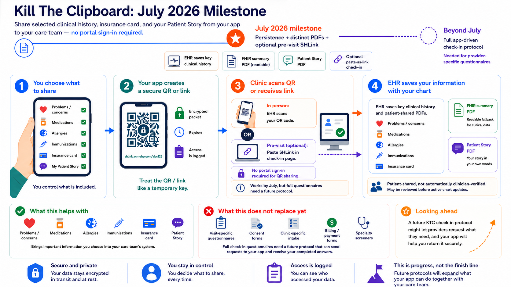

*After discussion with Dave deBronkart at the Health Level Seven International working group meeting cookie break, I realized our* [*KTC Spec*](https://ktc-spec.github.io/) *is great for developers but not really accessible for patients, clinicians, and other stakeholders. There's lots of work on more public materials, but I thought it'd be worth a quick update / explainer here.*

Intake at a doctor's office still looks different in every clinic. Some hand you a paper clipboard. Some email you a portal link the week before. Some pass you a tablet at the front desk, or text you a check-in link that opens on your phone in the waiting room. A specialty visit can hit you with several of these in sequence. The common frustration is that almost every clinic asks for the same information about your medications, allergies, problems, and immunizations — and almost none of them can get that information from anywhere except you, typed in fresh every time.

"Kill The Clipboard" is a long-term community, standards, and implementation effort to fix this! The idea is that patients should be able to share health information from an app they already use — the way you might show a boarding pass at the airport — so that clinics receive it without you retyping it, and without you needing a portal account at the receiving clinic.

We're making progress in stages, with the [CMS Health Ecosystem](https://www.cms.gov/priorities/health-technology-ecosystem/overview) helping to convene and shape this community work. As of April 2026, a clinic receiving a patient-shared PDF is required to keep it attached to the chart, with a label identifying it as something the patient provided. PDF contents are up to the patient — anything they want to send their care team.

As of July 2026, the same kind of requirement covers structured data. When you share your medications, allergies, active problems, or immunizations from your app as FHIR resources, the receiving EHR has to save this structured data into your chart. Why go deep with FHIR? A PDF often sits in the chart without connecting to anything else; a clinician typically has to open it, read it, and manually retype anything they want to use. (Of course: this is all changing with AI, but that is a topic for [another discussion](https://www.linkedin.com/pulse/fulfilling-cures-act-conversational-interoperability-josh-mandel-md-jevoe)!) Structured data can appear in the same lists the clinic already looks at. Your shared allergies can sit alongside the clinic's allergy list for review. Your shared medications can be checked against what the clinic already has on file.

The initial list of resources that an EHR must persist is short on purpose: the "PAMI" data set of problems, medication requests, allergies, and immunizations. The rest can grow from there, withe a goal that EHRs will eventually support persisting full clinical history using FHIR US Core. To enable a smooth transition, apps today are expected to include any FHIR US Core data the patient wishes to share; EHRs persist at least the FHIR PAMI content + PDFs, and will start importing more structured FHIR content as they're ready.

### What "saved in your chart" actually means

When you share a medication list, the clinic isn't required to treat that as your verified medication list. In many workflows, a clinician will review what you sent before any of it moves onto the active list. The "shared by patient" label can stay attached until somebody verifies it.

How this looks will vary across EHRs; we're not trying to standardize the clinician-facing UI paradigm. Some systems file the structured data directly into chart sections. Others keep the shared bundle as an attached document and surface its contents through a different view. Either way, the information stays attached to your record, properly labeled, and available to whoever opens the chart next.

### Two kinds of PDF

A patient app can now provide two kinds of patient-shared PDF.

The first is a **readable summary of the FHIR data you shared** — a print-out of your med list, allergy list, and so on, generated automatically. It exists for systems and people that can't easily work with the structured data directly. A backup view, in plain text.

The second is a **Patient Story** PDF: your own words. Not a rote summary of clinical facts (those are in the structured data) but the things the structured data can't capture. What you're most worried about. Something in your record you believe is wrong and want corrected. Context that explains what's going on for you. Something like:

> My biggest concern is that I'd like the care team to know that fatigue is affecting my daily life more than pain.

Patient advocates have argued for years that there should be a place in the chart for the patient's own narrative, distinct from a clinician's note about the patient. The July requirements make the Patient Story PDF its own artifact type, and the receiving EHR has to keep it.

### Sharing before the visit

The main way this works is in person: you arrive at check-in, you show a QR code from your app, the clinic scans it. There's also an option for sharing ahead of time. If a clinic's online check-in page includes a field for a SMART Health Link (the technical name for the secure link your app generates), you can paste that link before your visit and the clinic gets everything in advance.

The mechanics are awkward. You leave the check-in page, switch to your health app, decide what to share, generate a link, copy it, switch back, paste it. The clinic also can't tell your app what they need for this particular visit — you're guessing at what's relevant, and they're taking whatever shows up.

### What the new requirements don't change

The new requirements cover the questions that get repeated at every visit: your medications, allergies, problems, immunizations, insurance, and the context you want your care team to understand. A meaningful slice of the clipboard.

But we have a long way to go! Visit-specific questionnaires. Reason-for-visit questions. Social-needs questions a particular clinic chose to ask. These exist because a specific clinic, on a specific day, needs a specific answer from you. The current setup has no interoperable way for the clinic to ask, and no way for your app to answer. So you'll still fill those out.

### What comes next

The piece that would finish the clipboard is a check-in protocol where the clinic can tell your app what it needs for this visit, and your app can answer back — questionnaires, specific data, etc — reviewed and approved by you, in an app you trust, on a device you own. The same protocol whether you're doing it at home the night before, on the bus that morning, or scanning a QR code on the wall of the waiting room.

A working prototype exists: [SMART Health Check-in](/blog/posts/killing-the-clipboard-update-on-smart-health-check-ins-with-w3c-digital-credential-iso-mdoc-flow), an open-source sketch where the clinic side asks for specific things — health records, questionnaires, insurance coverage — and the patient's wallet app responds with the requested items plus a status for each (fulfilled, declined, partial). It runs in the browser, works on a phone or at a kiosk with handoff to the patient's phone, and shows what a future check-in protocol could look like. It's a prototype, not a standard, but it makes the shape of what comes next concrete enough to argue about.

The progression so far: as of April, your shared documents have a place in the chart. As of July, your shared structured PAMI data does too. Each step expands what patients can move themselves and what clinics are required to retain. For a full check-in protocol, we'll need to keep pushing.