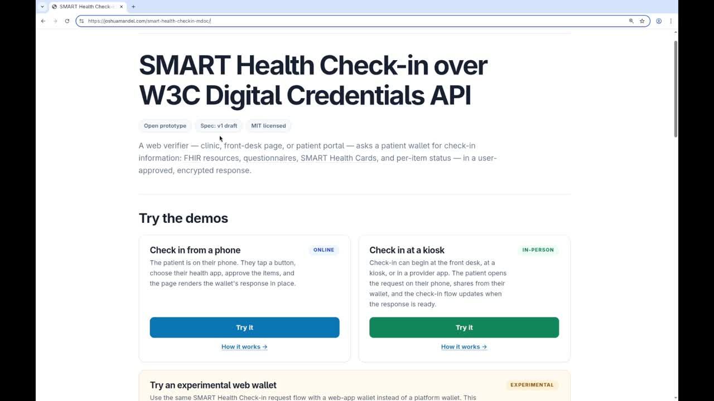

Waiting room clipboards are a persistent friction point in healthcare. Patients fill out identical intake forms and hand over physical insurance cards, appointment after appointment.

[Watch the video on LinkedIn (12:36)](/blog/posts/killing-the-clipboard-update-on-smart-health-check-ins-with-w3c-digital-credential-iso-mdoc-flow)

Increasingly, we have the building blocks to fix this. Today, I am sharing an updated proposal for a cross-platform SMART Health Check-in protocol that allows healthcare providers to explicitly request data, and allows consumer-facing mobile health apps (sometimes called "health wallets") to securely fulfill those requests.

Crucially, we are starting to overcome the platform fragmentation that historically stalled these efforts. This protocol is now implementable across both Android and iOS ecosystems.

### Patient Experience: Remote and In-Person

Sharing information should be as simple as a single tap, whether you are at home or standing at the front desk.

* **Remote Pre-Visit Check-In:** Patients complete a check-in process ahead of their appointment. This process include a "share" button that opens a native health app, displays exactly what the clinic is requesting, and allows patients to review, select what to share, and approve.
* **In-Person Kiosk Check-In:** Arriving at the clinic, a patient scans a QR code displayed on a registration kiosk or tablet. This triggers the exact same sharing flow ("share" button -> app -> review -> select -> approve) on their mobile device.

In both scenarios, patients can share a rich payload of data. This includes administrative information (demographics, digital insurance cards), clinical content via FHIR US Core resources (allergies, medications, problems), and visit-specific questionnaires that the health wallet can help auto-fill.

### Architecture and mdoc wrapper

From a healthcare standards perspective, requests are simple, flexible JSON objects. They dictate required information using specific FHIR profiles (such as the CARIN digital insurance card) or broader profile classes (like anything from FHIR US Core).

Transport relies on the W3C Digital Credentials API. This is where cross-platform challenges emerge.

Android allows wallets to register for highly flexible, custom protocols. iOS, however, strictly limits the W3C Digital Credentials API to the ISO mdoc format within Safari. To solve this constraint, we wrapped the SMART requests completely inside an ISO mdoc request. This ensures native support on Apple devices without shedding the flexibility and clinical depth of FHIR. You can view this mdoc wrapper as important enabling infrastructure or as wire-protocol baggage, but handing off a request to a native mobile wallet now works reliably on both major operating systems.

*Notably: in this design, we pass data along as regular FHIR JSON or as signed SMART Health Cards; data holders do not need to built out a new mdoc-based data issuance protocol.*

Looking to the future, I have also drafted a cross-tab web sharing interface. Users shouldn't be locked exclusively into natively installed mobile apps; web-based wallets need a pathway to receive these same mdoc requests and return data to the source page.

### Where This Fits in the Ecosystem

As we build better Health Information Networks (HINs) for consumer-mediated exchange, this protocol serves three distinct and necessary roles:

* **Escape hatches for backend networks:** HINs are excellent when they work, but they are not ubiquitous. Roadblocks, delays, and coverage gaps happen. Keeping patients in the loop provides a reliable escape hatch to ensure data flows even when backend networks fail.
* **Sharing patient-generated data:** Individuals hold valuable data that will never live in an EHR or an HIN. Wearable step counts, device activity tracking, and patient-reported outcomes exist on personal devices. This protocol creates a standardized pathway to push that data into the clinical workflow.
* **Building better questionnaires:** Filling out pre-visit forms inside generic patient portals can be incredibly cumbersome. Decoupling form-filling from rigid portals opens the door for developers to compete on design. We can build smarter, more intuitive health apps that actively assist patients in curating and sharing their narrative.

### What's Next

We've made significant progress utilizing static QR codes with SMART Health Links. Wrapping those capabilities into an interactive, end-to-end check-in protocol is the necessary next step to finally kill the clipboard.

Everything I demonstrated today is open source. I invite you to test the reference implementations, review the draft specifications, and help build out the future of consumer-mediated exchange.

* **Watch the full demo:** 
<iframe width="560" height="315" src="https://www.youtube.com/embed/2SSidwkiTVM" title="YouTube video player" frameborder="0" allow="accelerometer; autoplay; clipboard-write; encrypted-media; gyroscope; picture-in-picture" allowfullscreen></iframe>

* **Demo and specs:** [**https://joshuamandel.com/smart-health-checkin-mdoc/**](https://joshuamandel.com/smart-health-checkin-mdoc/)
* **Source:** <https://github.com/jmandel/smart-health-checkin-mdoc>