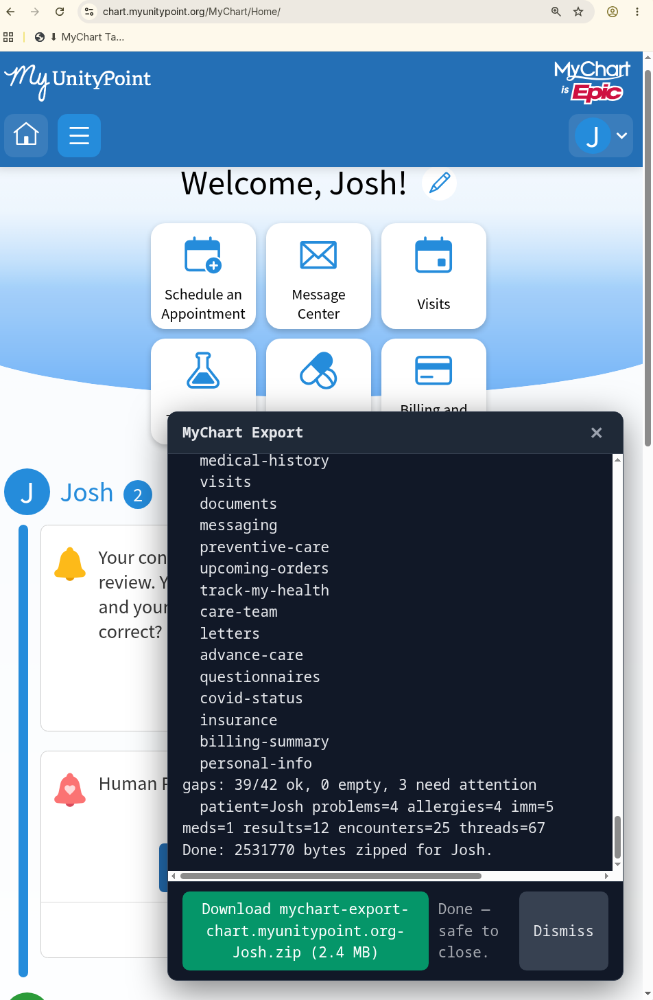

If your healthcare provider uses the Epic EHR, you can see a lot of your medical record in MyChart: problems, medications, lab results with reference ranges, imaging reports, appointments, visit notes, provider messages, immunizations, referrals, and more. Getting a complete copy *out* of the portal is harder than it should be.

The portal's "Download My Record" button gives you a C-CDA, which is a clinical summary, but that [leaves out a lot](https://www.linkedin.com/pulse/your-c-cda-exquisitely-unlikely-satisfactory-ehi-josh-mandel-md-gr90c). SMART on FHIR is a great option, but it only offers access to USCDI data. EHI Export is much more complete, but organizations hide it behind a fax and often a multi-week wait, with low completion rates. MyChart shows you a reasonably complete, readily available data set, but there is no built-in way to save it all.

So I built [MyChart Takeout.](https://joshuamandel.com/mychart-takeout/) (This was like a 3h project automated by Claude Fable and a modicum of Josh-style prompting/vision.)

Screenshot of the MyChart Takeout export flow

### What it is

A small script that runs in your browser, in a MyChart session you're already logged into, and saves your record as a ZIP file. You install it by dragging a button to your bookmarks bar. Then you open your portal, log in as usual, and click the bookmark. A few minutes later you get a download.

Everything runs on your own computer. There is no server and no account. The script never sees or stores your password; it uses the login session you already have. The [code is on GitHub](https://github.com/jmandel/mychart-takeout), so you can read all of it before you run it.

### How it works

The MyChart website is a front end over an internal JSON API. When you open the test results page, the site requests JSON. When you open a visit, it requests the after-visit summary and notes as HTML. MyChart Takeout makes those same requests from inside the logged-in page, with your cookies, and saves the responses to files. It also downloads the C-CDA "all visits" package when the site offers one.

The process is deterministic: every endpoint, parameter, and filename is fixed in the code or derived from the responses. No language model touches your data. (I used AI tools to help write the code. The tool itself does not use AI.)

The ZIP contains:

* Structured JSON for each area: problems, allergies, medications, immunizations, medical, family, and social history, insurance, care team, goals, referrals, pediatric growth charts, and patient-entered vitals.
* Lab and imaging results, including values, units, reference ranges, abnormal flags, and radiology and pathology reports.
* Every encounter, with its after-visit summary and clinical notes (as HTML).
* Secure message threads with full message text.
* The C-CDA package, unpacked.
* A readable PATIENT\_SUMMARY.md and flat CSV indexes, generated from the data above.

Your record may include data from other health systems. Epic portals often pull in records from other organizations where you were treated (through Happy Together and Care Everywhere), so a single export can contain records that started elsewhere. Where the portal labels this, most items carry an organizationName and an isExternal flag.

If you have proxy access to a child or dependent, you can export their record too: switch to their chart in MyChart first, then run the tool. The command-line version can also walk through all your proxies automatically.

> ***A note of caution***

*A bookmarklet is code that runs inside your logged-in session, with all the access you have there. That is what makes this tool possible. It is also what makes tools like it dangerous when they come from someone you don't trust. A malicious script installed the same way could send your records to a stranger, capture your credentials, or act in your account. Mine runs entirely on your own computer, and the code is public so anyone can check what it does -- but that only helps if someone actually reads it. If you can't review the code yourself, make sure you really trust whoever is providing it. Asking an AI to review can help, too (but a determined attacker can hide behavior that a quick review will miss). This is not hypothetical: health systems are seeing a rise in attackers trying to trick patients into running scripts in their portals.*

### Try it

[joshuamandel.com/mychart-takeout](https://joshuamandel.com/mychart-takeout) has the install button and instructions. Your export.zip file will include a "SKILL.md" explaining how to work with the data. The source code and a more technical writeup are [on GitHub](https://github.com/jmandel/mychart-takeout).