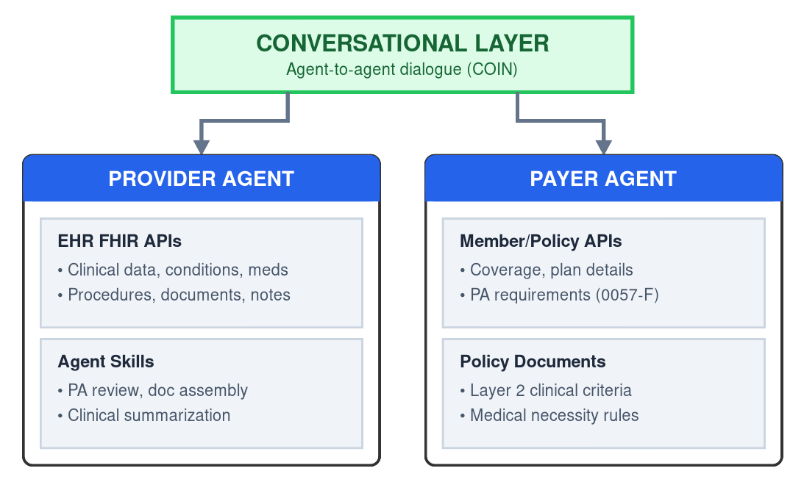

The CMS Interoperability and Prior Authorization Final Rule ([CMS-0057-F](https://www.cms.gov/newsroom/fact-sheets/cms-interoperability-and-prior-authorization-final-rule-cms-0057-f)) sets the right goals: reduce administrative burden, speed access to care, and save an estimated $15 billion over ten years. The required functionality (looking up a member's plan; identifying documentation requirements; submitting prior authorization requests; tracking decisions) provides a solid foundation.

But the technology landscape has shifted dramatically since this work began. The emergence of agentic AI means we no longer need rigid, sequential workflows where humans painstakingly translate clinical policies into computable formats. We can reason about policies as they exist today.

This offers CMS an opportunity to make 0057-F more successful, at lower cost and friction, without rewriting the rule.

### What CMS Should Do

CMS could develop an **Open Prior Auth Toolkit**: guidance, reference implementations, and test harnesses that help the ecosystem navigate coverage and clinical necessity rules. This would set industry up for success with 0057-F in creative, pragmatic ways. The "funding" comes from industry savings when participants don't have to build redundant infrastructure just to meet rules.

Specifically, CMS should lead on:

1. **Clarity on "Layer 2" transparency**: As I've [written previously](/blog/posts/the-prior-auth-api-is-a-trap), 0057-F requires disclosure of "documentation requirements" but leaves ambiguity about actual evaluation criteria. If a payer says "submit documentation of conservative therapy" and then denies because "your conservative therapy doesn't meet our criteria," did they really communicate the requirements? Guidance (or future rulemaking) should require disclosure of these detailed criteria.
2. **Trust infrastructure**: Encourage industry development of agent-to-agent authentication frameworks, and build connectors that leverage [SMART on FHIR](https://smarthealthit.org/) authorization. This could include expanding authorization infrastructure to support a stronger trust fabric through CMS-aligned networks.
3. **Open-source**: The structured API services that conversational agents need, plus a simple reference implementation showing how today's frontier models can orchestrate them. This could be built in collaboration with existing CMS health tech pledgees.
4. **Community engagement**: Following the [Data at the Point of Care (DPC)](https://dpc.cms.gov/) model, build in the open with implementers, iterate based on feedback, and create resources that lower barriers to adoption.

By developing this common infrastructure, CMS would:

* **Lower the burden for payers**: They publish policies at stable URLs, deploy an instance of the API server, and optionally deploy an agent that speaks the conversational protocol.
* **Empower providers**: EHR vendors and third parties can build "smart assistants" that guide clinical decisions upstream so documentation is right the first time.
* **Create a de facto standard**: Not through mandate, but through utility. If the open tools work better and cost less, adoption follows.

### A Conversational Approach

The [Da Vinci Implementation Guides](https://www.hl7.org/fhir/us/davinci-pas/) (Coverage Requirements Discovery, Documentation Templates and Rules, Prior Authorization Support) represent one approach to meeting 0057-F's requirements. CMS [recommends but does not require](https://www.cms.gov/newsroom/fact-sheets/cms-interoperability-and-prior-authorization-final-rule-cms-0057-f) these IGs.

The Da Vinci model assumes distinct, sequential phases: discover requirements (CRD) → fill out template (DTR) → submit and track (PAS). This works, but requires payers to re-engineer clinical policies into structured, computable formats. That's a massive undertaking that creates friction and delays adoption.

What if we merged these steps into a more fluid exchange? Agent-to-agent dialogue where requirements are surfaced, evidence is assembled, and gaps are negotiated in real-time.

This still satisfies 0057-F and builds on FHIR-based data access:

* ✓ "Identify member, plan, and policy" (within conversation)
* ✓ "Identify documentation requirements" (within conversation)
* ✓ "Track prior authorization status" (conversation triggers submission, tracking)

The difference is *mechanism*: dialogue rather than a rigid pipeline. This approach draws on patterns I've described as [Conversational Interoperability (COIN)](/blog/posts/fulfilling-the-cures-act-conversational-interop-as-a-successor-technology): authenticated software agents holding short, flexible conversations, with data access approved and auditable by patients.

### The Architecture

The key insight is that we can develop *both* next-generation conversational interfaces *and* the underlying APIs, skills, and open data components that make them work. The core back-and-forth between provider and payer can be COIN-based (flexible, natural language dialogue), while under the hood the agents leverage narrower, structured APIs that fulfill 0057-F requirements.

Architecture diagram showing conversational layer on top, with provider-side and payer-side agents leveraging open APIs, skills, services and data repositories

The **provider-side agent** sits in the clinical workflow. When a PA is needed, it uses EHR FHIR APIs to gather clinical data, initiates a COIN conversation with the payer-side agent, assembles documentation as requirements become clear, and negotiates when gaps exist.

The **payer-side agent** responds conversationally, but under the hood it queries Member/Policy FHIR APIs (0057-F required) for coverage and plan details, looks up policy requirements, and communicates what's needed for approval.

The payer-side services could encompass:

* **API entrypoints**: Traditional lookup for member → plan → policy documentation
* **Complete "Layer 2" documentation**: Stable URLs to detailed clinical criteria (PDF, HTML, or structured text)
* **Conversational endpoint**: An agent that supports COIN interactions leveraging the components above

The conversational layer doesn't replace the APIs; it orchestrates them. And because the APIs exist, the conversation can be grounded in real data rather than hallucination.

### Why This Matters Now

Anthropic recently announced [Claude for Healthcare](https://www.anthropic.com/news/healthcare-life-sciences), including connectors to the CMS Coverage Database, ICD-10, and the National Provider Identifier Registry, plus agent skills for FHIR development and prior authorization review. These are exactly the kinds of capabilities that need open rails to run on.

At the [September 2025 HL7 Connectathon](/blog/posts/conversational-interoperability-takes-shape-a-read-out-from-the-hl7-connectathon), a dozen participants spent two days building and connecting agents for prior authorization, referrals, and clinical trial matching. The community interest and hands-on experience here are significant, and growing.

States like Colorado and Illinois have already started mandating publication of clinical criteria. CMS could extend this by developing reference implementations and promoting industry adoption.

### Privacy by Design

Traditional prior auth often involves over-sharing: providers send massive C-CDAs or FHIR Bundles, forcing payers to rummage through patient history. This violates the spirit of minimum necessary.

Conversational agents mitigate over-sharing by design. The agent reads the policy, asks the EHR specific questions, and extracts only the data points required to prove medical necessity. Each exchange is logged with an immutable receipt. The patient (or their designated agent) can see every dialog turn and file attached.

This aligns with the Cures Act's vision of patient-accountable access pathways, what I've called a [Minimum Interoperability Network for Trust (MINT)](/blog/posts/fulfilling-the-cures-act-conversational-interop-as-a-successor-technology).

### Bottom Line

0057-F can succeed with open components that make conversational prior authorization a reality.

We've seen CMS take this kind of leadership role before. [Data at the Point of Care](https://dpc.cms.gov/) didn't just regulate; CMS built a reference implementation that proved claims data could flow via FHIR APIs to providers at the point of care.

---

*For more background on these concepts, see:*

* [Fulfilling the Cures Act: Conversational Interoperability as a "Successor Technology"](/blog/posts/fulfilling-the-cures-act-conversational-interop-as-a-successor-technology)
* [Conversational Interoperability Takes Shape: A Read-Out from the HL7 Connectathon](/blog/posts/conversational-interoperability-takes-shape-a-read-out-from-the-hl7-connectathon)
* [The Prior Auth API is a Trap](/blog/posts/the-prior-auth-api-is-a-trap)
* [CMS Data at the Point of Care](https://dpc.cms.gov/)
* [CMS-0057-F Fact Sheet](https://www.cms.gov/newsroom/fact-sheets/cms-interoperability-and-prior-authorization-final-rule-cms-0057-f)