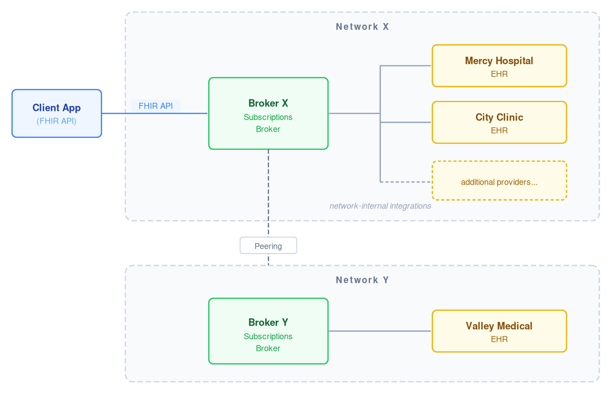
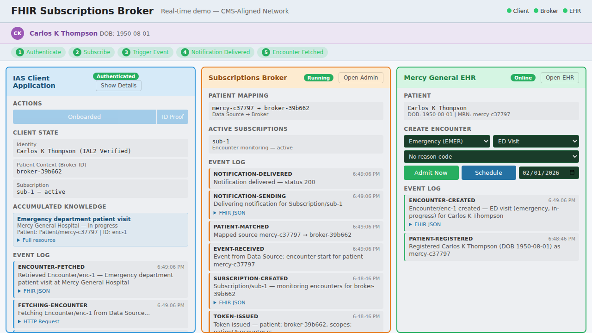

The CMS Interoperability Framework asks CMS-Aligned Networks to deliver appointment and encounter notifications using FHIR Subscriptions. While provider-level FHIR Subscriptions would be great (and I hope to see them land in HTI-6!), they aren't a solution to this CMS requirement because...

> **You can't subscribe individually to *every* hospital/provider/practice in the whole USA**

If an application wants to know when a patient visits *any* ED, specialist, or urgent care clinic, it would need to establish a subscription at every possible site of care. You can never know in advance where a patient might show up. And the CMS requirement covers scheduled appointments too, not just encounters. Existing B2B integrations like ADT feeds tell you when a patient is admitted or discharged; they don't necessarily tell you about the referral booked for next week.

Even setting this concern aside, the "edge node" infrastructure doesn't exist. Where FHIR APIs are available today, they require provider-specific registration, credentials, and approvals. Most don't support FHIR Subscriptions at all.

### The Brokered Approach

Based on CMS workgroup discussions, I'm documenting a **Subscriptions Broker** architecture proposal:

> **One connection. Network-wide reach.**

Instead of subscribing at individual data sources, an application creates a single FHIR Subscription at the Broker. The Broker handles everything else: arranging to receive events from participating providers, peer networks, and payers, then delivering them as standard FHIR notification bundles following the design of US Core Patient Data Feed. Each Client connects once to the Broker; the Broker manages integrations with all network data sources and peer networks.

Client connects once to the Broker; the Broker manages integrations with all network data sources and peer networks.

The application doesn't need to know where a patient will be seen or integrate with each site's technology. It sees a clean FHIR Subscriptions API; the network handles discovery and routing.

### What the Broker Abstracts Away

Behind that single API surface, the Broker may:

* Create FHIR Subscriptions at data sources that support them natively
* Configure HL7v2 ADT routing from sources that use ADT feeds
* Poll data sources that don't support push
* Query a Record Locator Service to discover where a patient has received care
* Register for events from peer CMS-Aligned Networks
* Convert events from HL7v2, CCDA, or proprietary formats into FHIR notifications

None of this is visible to the client. The client creates a Subscription, receives notification bundles, and retrieves resources.

### Patient Identity Without Cross-Org Identifiers

Patients don't have a single stable identifier across organizations. The brokered model doesn't require one.

Instead:

1. The client presents **IAL2-verified identity attributes** (demographic data from a trusted identity provider like CLEAR or ID.me) when requesting an access token
2. The Broker performs patient matching internally and returns a **broker-scoped** Patient.id in the token response
3. The client uses that ID in subscription filter criteria

This Patient.id is meaningful only at the Broker, not a cross-organization identifier. How the Broker resolves identity for incoming events is a network-internal concern; the spec describes several approaches (centralized MPI, provider-confirmed matching, hybrid) but doesn't mandate one.

### What's Specified vs. Network-Internal

The spec is explicit about what's standardized and what isn't:

**Standardized (client-facing):** Token request to Broker, FHIR Subscription creation, notification bundle delivery, data retrieval from source.

**Network-internal:** Broker arranges event feeds, ADT routing, polling, RLS queries, patient matching approach, peer network coordination.

We're not trying to standardize how networks operate internally, just the API contract that lets any conformant client participate.

### Open Questions

This is a proposal, and some things need more work:

**Authorization and consent propagation.** How does a client present identity and consent credentials in a token request, and how does that context propagate to data sources? For an initial pilot scoped to patients accessing their own data, implicit authorization is defensible. But that won't scale to designated representatives, caregivers with partial access, minors, or sensitive data categories.

The Argonaut Project is considering a 2026 initiative on "SMART Permission Tickets" that could help here, encoding identity, consent, and related details into portable, use-case-specific cryptographic artifacts. The CMS Patient Preferences and Consent Workgroup is working on related policy concepts.

### Try the Demo

I built a demo that runs three services in your browser: an IAS client application, a Subscriptions Broker, and a simulated EHR (Mercy General).

[**Live Demo**](https://joshuamandel.com/cms-fhir-subscriptions-broker/)

You can:

1. **Auto-Onboard** a randomly generated patient through IAL2 identity verification
2. Watch the Broker establish **patient identity mapping** across systems
3. **Create an encounter** at the EHR (choose encounter type, class, reason)
4. See the **notification flow** in real time across all three panels
5. Inspect the actual **FHIR JSON** for subscriptions, notifications, and encounters

Patient onboarded with IAL2 verification; appointment schedule at a hospital; notification routed through the Broker; encounter data retrieved by the client.

### Resources

Everything is on GitHub:

* [**Full Specification**](https://github.com/jmandel/cms-fhir-subscriptions-broker/blob/main/index.md): Architecture, protocol flows, authorization model
* [**FAQ**](https://github.com/jmandel/cms-fhir-subscriptions-broker/blob/main/faq.md): Trust model, patient matching, privacy, relationship to existing specs
* [**End-to-End Example**](https://github.com/jmandel/cms-fhir-subscriptions-broker/blob/main/e2e-ias-example.md): Complete IAS app walkthrough with every step labeled
* [**Live Demo**](https://joshuamandel.com/cms-fhir-subscriptions-broker/): Interactive demonstration

I'm presenting this to the CMS FHIR Subscriptions Workgroup next week. If you're part of a network, payer, EHR vendor, or app developer that's excited to try, implement, or build around this approach, I'd love to hear from you.

*What's missing? What won't work in your environment? Let's figure this out together.*