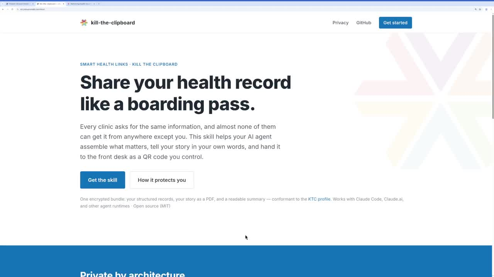

In my [previous update](/blog/posts/kill-the-clipboard-for-july-2026-sharing-fhir-data-patient-stories) on the [Kill The Clipboard (KTC) initiative](https://ktc-spec.github.io/), I outlined our primary goal: replacing the repetitive, frustrating process of clinic intake with a seamless digital handoff. Patients should be able to share their health data—structured FHIR resources, clinical notes, and their own personal narrative—from an app they already use. The experience should be as simple as presenting a boarding pass at the airport.

[Watch the video on LinkedIn (11:23)](/blog/posts/share-your-health-record-like-a-boarding-pass-ai-agents-help-kill-the-clipboard)

However, a major practical challenge remains. How can we make it easy for patients to curate years of complex medical records into a concise, relevant package for a specific doctor's appointment? Expecting patients to manually sort through raw data files or search for specific progress notes from years ago is not a realistic solution.

To address this, I have been developing a method that integrates AI agents into the workflow. Ahead of our panel session at DevDays in Minneapolis next week (with Anthony Pizzi, e-Patient Dave, and James Cummings), I have recorded a demonstration showing how we can use large language models, like Claude, to do this heavy lifting.

Here is a look at the new **Kill The Clipboard AI Agent Skill**.

### The Demonstration: Preparing for a Neurology Consult

Using an AI environment, a patient can upload the new KTC skill.zip file (which contains instructions and backend scripts). This provides the AI with the specific instructions it needs to act as a privacy-preserving medical records assistant.

In the 
<iframe width="560" height="315" src="https://www.youtube.com/embed/jIsHPZDfE64" title="YouTube video player" frameborder="0" allow="accelerometer; autoplay; clipboard-write; encrypted-media; gyroscope; picture-in-picture" allowfullscreen></iframe>
, I first pulled 8 years of my own health data from a local provider using SMART on FHIR tools. Then, I gave the agent a simple instruction:

> *"Help me prepare for a neurology consult."*

Here is how the AI agent responded:

1. **Reviewed the Standards:** The agent read the Kill The Clipboard specifications to understand exactly what a SMART Health Link (SHL) is and what data the clinic will expect to receive.
2. **Curated the Data:** It scanned my 8-year clinical history and filtered out routine check-ups. Instead, it identified a concussion I had in 2020 and pulled the relevant spine x-rays, occupational therapy notes, and brain imaging.
3. **Drafted the "Patient Story":** A core requirement of the KTC specification is allowing patients to share their own narrative in their own words. The AI drafted a concise "Patient Story" from my perspective, summarizing the lingering effects of the concussion and my goals for the upcoming neurology visit.
4. **Generated the Secure Link:** Finally, the agent packaged the structured FHIR data, the clinical progress notes, and the Patient Story into an encrypted bundle, generating a secure [SMART Health Link](https://build.fhir.org/ig/HL7/smart-health-cards-and-links/).

### The Provider Experience and Patient Controls

The output of this curation process is a simple QR code or URL.

When the patient arrives at the clinic, the front desk can scan the QR code. If the clinic's Electronic Health Record (EHR) is fully integrated, the structured data (Problems, Allergies, Medications, Immunizations) and the Patient Story flow directly into the patient's chart.

If the EHR does not natively support SMART Health Links yet, the link opens a secure web viewer built as a fallback. This allows the clinician to read the Patient Story, review a generated summary PDF, read the curated progress notes, and view the raw FHIR resources.

**Crucially, the patient remains in control of their data at all times.** The KTC skill provides a control panel for the generated link where the patient can:

* **View an Access Log:** See exactly who opened the record (e.g., "Example Doctor") and when.
* **Pause Sharing:** Temporarily disable the link.
* **Revoke Access:** Permanently disable the link and delete the hosted data when the visit is over.

### Next Steps

By combining the standardized infrastructure of SMART Health Links with the reasoning capabilities of AI, we can significantly reduce the friction of health data sharing. The AI acts as a personal archivist, ensuring the clinician has exactly the context they need, perfectly formatted, before the visit begins.

**Resources & Links:**

* **Download the Skill & Try the Demo:** Visit [ktc.joshuamandel.com](https://ktc.joshuamandel.com/) to get the [SKILL fileSKILL file](https://ktc.joshuamandel.com/skill.zip) and see the control page in action.
* **Review the Specifications:** Read the [Kill The Clipboard Spec](https://ktc-spec.github.io/) and the underlying [HL7 SMART Health Links Spec](https://build.fhir.org/ig/HL7/smart-health-cards-and-links/).
* **Source Code:** Available on my GitHub at <https://github.com/jmandel/kill-the-clipboard-skill>.

If you are attending DevDays in Minneapolis next week, please join our panel session. We will be discussing the cultural and technological shifts required to make this workflow the new standard of care.