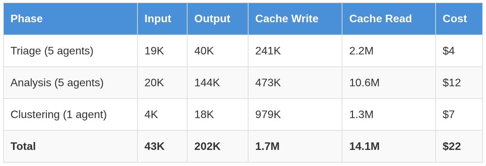
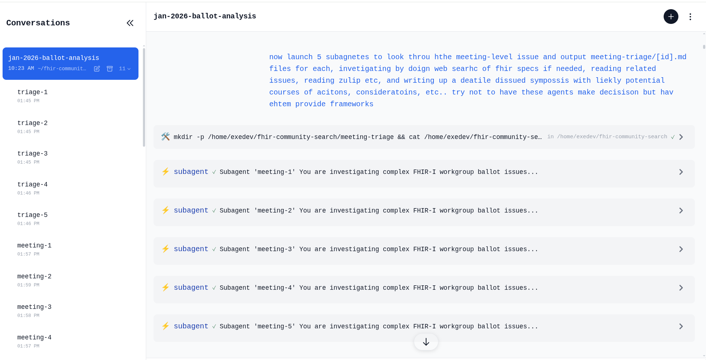

When a task is too big for one context window, the answer (in mid-January 2026) is more agents, not a bigger window.

I needed to prepare for an HL7 workgroup meeting with 208 open ballot issues. Realistically, nobody reviews all of these ahead of time; you triage on the fly during the meeting. With eleven agents running in parallel, I had structured prep in about 30 minutes for $22.

* [**Triage buckets**](https://github.com/jmandel/fhir-community-search/blob/main/examples/2026-01-wgm/02-triage-buckets/blockvote.txt) — 208 issues sorted into blockvote (81), phonecall (68), meeting (59)
* [**Deep analyses**](https://github.com/jmandel/fhir-community-search/blob/main/examples/2026-01-wgm/03-meeting-analyses/FHIR-54473.md) — 59 research documents with stakeholder positions, options, and tradeoffs
* [**Thematic clusters**](https://github.com/jmandel/fhir-community-search/blob/main/examples/2026-01-wgm/04-meeting-quarters/01-fhirpath-normative-readiness.md) — Issues grouped into 90-minute meeting quarters with interdependencies mapped

The agents don't make decisions—they prepare the materials so humans can.

### Why This Works Now

When a task exceeds one context window, partition it across agents running in parallel, then synthesize. MapReduce, but conversational.

This almost worked six months ago. If you were willing to write code to glue and orchestrate the raw capabilities, you could do cool things (e.g., [How to Read 10,000 Pages of Public Comments](/blog/posts/how-to-read-10000-pages-of-public-comments), my pipeline for analyzing federal register comments)

But you had to build your own tooling; there were significant limitations in mid-2025 :

* **Model agentic abilities.** Unreliable tool use, multi-step planning, and judgment to recover when things go wrong.
* **Harness UX.** Clumsy or absent subagent capabilities.

Both have improved significantly.

### Decomposition Patterns

To successfully run a conversational pipeline (i.e. driven by your own discussion with a top-level agent, rather than pre-coordinated in code), you still need a pretty solid understanding of data volumes, task difficulty, and an overall pipeline flow for your analysis. You should think (ahead of time or on-the-fly) about how to...

* **Partition by task type / recognize sequential dependencies.** For example, if you want to analyze Jira issues, you might want a quick triage phase across all issues followed by a thorough, research-aided analysis phase to assess complex issues.
* **Partition within a task / recognize parallel independence.** Within a phase, agents run simultaneously, communicating through conversation or a shared filesystem. For a given task, what size "chunks" achieves the best trade-off to jointly optimize, time, cost, and performance?

---

### The Tooling

Before starting, I had built [fhir-community-search](https://github.com/jmandel/fhir-community-search): local SQLite databases with full-text search over 48k+ Jira issues from jira.hl7.org and 1M+ Zulip messages from chat.fhir.org. The CLI lets agents snapshot complete issues (with all comments) or entire chat threads, search with FTS5, and follow references. A skill.md file explains how to use it.

This matters because agents need tools that fit their workflow. "Search, snapshot, explore" works better than slow REST APIs. The agents read the README once, then query iteratively.

The Pipeline
------------

### Phase 1: Triage

*5 agents, $4*

A SQL query pulled 208 issues. Five agents each took ~42, snapshotted each issue, categorized it as BLOCKVOTE/PHONECALL/MEETING, and appended to shared files.

Result: [81 blockvote](https://github.com/jmandel/fhir-community-search/blob/main/examples/2026-01-wgm/02-triage-buckets/blockvote.txt), [68 phonecall](https://github.com/jmandel/fhir-community-search/blob/main/examples/2026-01-wgm/02-triage-buckets/phonecall.txt), [59 meeting](https://github.com/jmandel/fhir-community-search/blob/main/examples/2026-01-wgm/02-triage-buckets/meeting.txt).

### Phase 2: Analysis

*5 agents, $12*

Five agents split the 59 meeting issues. For each one: snapshot the issue, search Zulip for related discussion, pull in linked issues, then write a structured analysis covering current spec language, stakeholder positions, tradeoffs, options, and open questions.

Result: [59 markdown files](https://github.com/jmandel/fhir-community-search/tree/main/examples/2026-01-wgm/03-meeting-analyses) (example: [FHIR-54473](https://github.com/jmandel/fhir-community-search/blob/main/examples/2026-01-wgm/03-meeting-analyses/FHIR-54473.md)).

### Phase 3: Clustering

*1 agent, $7*

One agent read all 59 analyses and organized them into [10 thematic quarters](https://github.com/jmandel/fhir-community-search/tree/main/examples/2026-01-wgm/04-meeting-quarters) (example: [FHIRPath Normative Readiness](https://github.com/jmandel/fhir-community-search/blob/main/examples/2026-01-wgm/04-meeting-quarters/01-fhirpath-normative-readiness.md)). Each quarter includes interdependencies, anchor issues, key people, and a suggested discussion order.

### The Numbers

Token usage and calculated "off the shelf" pricing with Claude Opus 4.5

(Cache read is reuse of that content in subsequent calls. Each agent pays to write its context once, then reads it cheaply across many tool calls—14M cache reads cost ~$7 while 202K output tokens cost ~$5.)

### The Harness: exe.dev + Shelley

[exe.dev](https://exe.dev/) provides persistent VMs with a shared filesystem. Shout-out to [**Philip Zeyliger**](https://www.linkedin.com/in/philipzeyliger?miniProfileUrn=urn%3Ali%3Afs_miniProfile%3AACoAAAHYl0oBBk7eRC2c_OePT_RG6lFRaKVDfzU) for creating [Shelley](https://github.com/boldsoftware/shelley), an agent harness with recently-launched but first-class subagent support. (Cool things about Shelley: it launches sub-agents in inspectable conversations and allows the coordinating agent or the end-user to inspect and interact with sub-agents.)

This makes it easy to say things like: "Spawn five agents to handle these ranges of Jira issues." They run in parallel, appending to shared files. The coordinating agent can check progress with "ls \*.md | wc -l". No orchestration code required.

Screenshot of Shelley launching sub-agents

---

### Lessons

**Batch commands.** After watching agents make unnecessary sequential tool calls, we added guidance: combine commands with && when you know the steps upfront. One round-trip beats five.

**Point agents at documentation.** "Read jira/README.md to understand how to snapshot issues." The agent reads what it needs; the prompt stays focused.

**Files beat memory.** echo "FHIR-53951 | Typo" >> blockvote.txt is observable, recoverable, and requires no state serialization.

**Monitor mid-flight.** Check the counts/sizes of output files. When clustering ran longer than expected, we could see progress accumulating. When a prompt produced uneven results, we iterated.

**Prompts are guidance, not scripts.** The triage, analysis, and clustering prompts were starting points. Agents adapted when issues referenced others outside their assigned batch.

**Skills compound.** The FHIR search tools came with a skill.md explaining how to get the databases, run searches, and interpret results. Point an agent at it once; reuse across projects.

---

### Up-front planning lead to more efficient meetings!

This pipeline doesn't replace judgment. The HL7 working group meeting still happens, and humans still make the decisions. What changes is that co-chairs arrive a bit better prepared, with research done and options laid out. This helps discussion focus on decisions, not discovery.

---

### Artifacts

* **Triage** — [blockvote](https://github.com/jmandel/fhir-community-search/blob/main/examples/2026-01-wgm/02-triage-buckets/blockvote.txt), [phonecall](https://github.com/jmandel/fhir-community-search/blob/main/examples/2026-01-wgm/02-triage-buckets/phonecall.txt), [meeting](https://github.com/jmandel/fhir-community-search/blob/main/examples/2026-01-wgm/02-triage-buckets/meeting.txt)
* **Analyses** — [59 files](https://github.com/jmandel/fhir-community-search/tree/main/examples/2026-01-wgm/03-meeting-analyses) (example: [FHIR-54473](https://github.com/jmandel/fhir-community-search/blob/main/examples/2026-01-wgm/03-meeting-analyses/FHIR-54473.md))
* **Clusters** — [10 quarters](https://github.com/jmandel/fhir-community-search/tree/main/examples/2026-01-wgm/04-meeting-quarters) (example: [FHIRPath](https://github.com/jmandel/fhir-community-search/blob/main/examples/2026-01-wgm/04-meeting-quarters/01-fhirpath-normative-readiness.md))
* **Prompts** — [triage](https://github.com/jmandel/fhir-community-search/blob/main/examples/2026-01-wgm/prompts/01-TRIAGE-PROMPT.md), [analysis](https://github.com/jmandel/fhir-community-search/blob/main/examples/2026-01-wgm/prompts/02-ANALYSIS-PROMPT.md), [clustering](https://github.com/jmandel/fhir-community-search/blob/main/examples/2026-01-wgm/prompts/03-CLUSTERING-PROMPT.md)

Tools: [github.com/jmandel/fhir-community-search](https://github.com/jmandel/fhir-community-search)