The proposed CY2027 Physician Fee Schedule drew 43,082 public comments (about 50,000 pages). That's ~5x bigger than any docket I've analyzed before, and my old pipeline would have cost around $2k to run on it. So I spent some time improving the pipeline. It now groups form letters and campaign letters, works out who each comment speaks for, reads charts and tables in attachments, and publishes the whole analysis as downloadable databases. The full PFS run cost about $100.

> **TL;DR:** Browse the results in the [CY2027 PFS comment dashboard](https://joshuamandel.com/regulations.gov-comment-browser/CMS-2026-2377/). To explore the comments with your own AI assistant, give it the [skill file](https://joshuamandel.com/regulations.gov-comment-browser/skill/SKILL.md).

The results are in the [CY2027 PFS comment dashboard](https://joshuamandel.com/regulations.gov-comment-browser/CMS-2026-2377/). Thanks to [Travis Broome](https://www.linkedin.com/in/travisbroome/) and [Sean Cavanaugh](https://www.linkedin.com/in/sean-cavanaugh-a06062136/) at Aledade for suggesting this docket.

## Findings

Modifier 25 drew more comments than any other issue. CMS proposed paying 50% less for an office visit billed on the same day as a procedure, and 21,794 comments took that up — twice as many as addressed the overall cut to the conversion factor (10,368).

Most of that volume came from organized campaigns (including three campaigns about ENT care alone accounting for nearly 5,000 letters).

If you rank issues by "thoughtful submissions" (here: distinct letters longer than 1,500 words), the top three issues become: drug pricing and safety-net programs, MIPS and health IT, and remote patient monitoring.

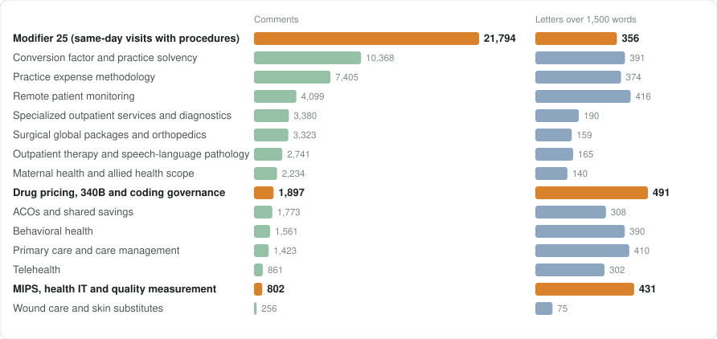

*The left bars count comments, including form letters. The right bars count distinct letters longer than 1,500 words. Because a comment can raise several issues, the counts add up to more than the totals.*

## Loading the docket

My earlier dockets came from regulations.gov 's bulk download. For this one I added support for [Mirrulations](https://github.com/MoravianUniversity/mirrulations), a public mirror of regulations.gov run by Ben Coleman's group at Moravian University. Mirrulations keeps an hourly copy of the site (about 27 million comments, attachments and text files) in a [public S3 bucket](https://registry.opendata.aws/mirrulations/). Because it's built with many donated API keys, it isn't held to the regulations.gov API's limit of 1,000 items an hour. I pulled all 43,000 PFS comments and 4 GB of attachments from it in under an hour. It's a great public service, and I'm glad the pipeline can use it now.

## Form letters and campaigns

Many comments are copies of the same letter. The pipeline now spots form letters even when senders add a paragraph of their own. It ignores "See attached" stubs, and it matches scanned copies of campaign letters once they've been transcribed. After that, the docket comes down to about 20,000 distinct texts.

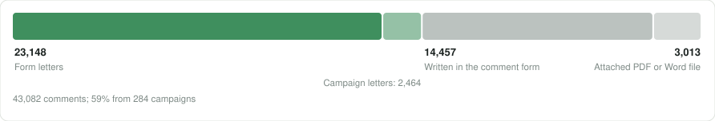

*Form letters are identical or nearly identical copies. Campaign letters make a campaign's argument in the sender's own words.*

Last year I [predicted](/blog/posts/next-wave-ai-for-public-comments) that AI-personalized campaigns would make simple copy-matching obsolete. So the pipeline now also groups letters by meaning. It embeds each letter, clusters the letters that make the same argument, and asks a model whether each cluster is a real campaign. It found 284 campaigns covering 25,612 comments. About 2,500 of those are campaign letters written in the sender's own words, which copy-matching would miss.

Next, the pipeline breaks each distinct text into its individual points, sorts the points into themes, and writes a report for each theme.

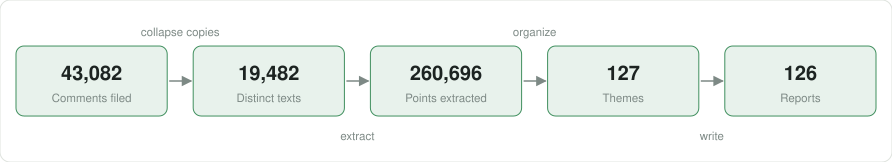

*There are more points than texts because a long letter can make dozens of separate points.*

## Cost

The full run cost about $100 in Gemini calls. Each step uses the cheapest model that does the job well: Flash-Lite for rote work like triage, and Gemini 3.8 Flash for synthesis. Long letters are read once against the whole theme list instead of once per theme, though pulling points out of every letter was still the biggest single cost.

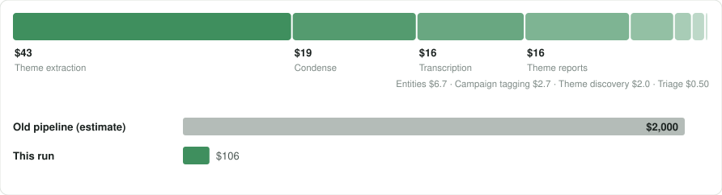

*The old pipeline's cost is an estimate based on per-comment costs measured on a sample.*

On PFS the pipeline makes about 30,000 model calls with about 270 million input tokens in total. Run live, the fastest possible time depends on Gemini's rate limits. My account is at Tier 3, which requires $1,000 of past spending and 30 days of history. At that tier Gemini 3.8 Flash allows 20 million input tokens a minute, so the whole run could finish in about 35 minutes for about $210. Getting there means keeping about 100 calls in flight, staying just under the token limit during the longest step, and retrying any calls that get rejected. At the pipeline's default of 20 calls at a time, the run takes nearly three hours.

Batch mode avoids all of that. Thousands of requests go up as one file, and Google schedules them. Batch calls cost half as much as live ones, which is how the full run came to about $100. The batch jobs took about three hours, and that was fine for a run I left to finish on its own. Each batch job is also recorded when it's submitted, so when my run was killed partway through, restarting it picked up the same jobs instead of paying for them again.

Before the full run I ran small experiments to choose models and settings, which cost about $50 in total. Blind comparisons showed that letting the model reason ("thinking") helped with theme discovery and report writing but nothing else, so it's turned off everywhere else. A 1-in-20 sample of the docket ran end to end for about $15 to make sure every step worked. I also checked whether a bigger model would write better reports, and in a blind comparison Gemini 3.8 Flash beat Gemini 3.1 Pro 8 to 3, even with Pro as the judge.

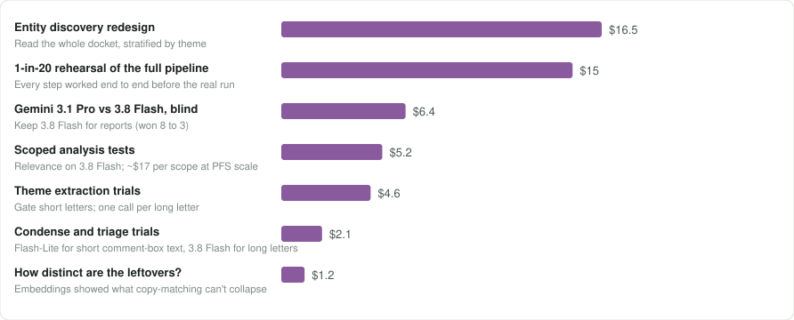

*A few small trials weren't metered, so the true total is a bit higher.*

## New features

Every docket now has two downloadable SQLite databases for your own analysis or an AI assistant's. For PFS they're 46 MB and 69 MB zipped. The databases document themselves: every column has a comment, and a _readme table explains where the data came from, lists caveats, and includes about ten worked example queries. Like my earlier switch from an MCP server [to a skill file](/blog/posts/from-mcp-server-to-ai-skill-a-simpler-more-powerful-way-to-analyze-federal-regulation-comments), this lets an AI assistant work with the data directly.

Scoped analyses let you point the analysis at one question, such as "interoperability and health IT" or "the issues raised in Johns Hopkins Medicine's letter." Each scope gets its own sub-site with its own themes and reports.

Entity tagging now reads the whole docket and found 819 entities (up from 128), including dQM, QRDA and TEFCA. Phrase search now downloads 0.4 MB instead of 28 MB, and the overview page has been redesigned.

## Building it with Claude Code

This project used two AI systems. I steered Claude Code, which wrote and tested the pipeline, and the pipeline uses Gemini to read the comments.

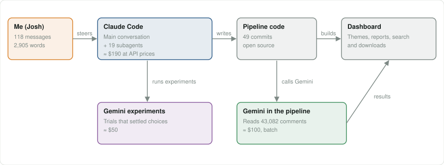

*Claude Code wrote the pipeline and ran the Gemini experiments. The pipeline calls Gemini to read the comments.*

I built all of this in one Claude Code conversation. My messages fell into six sittings, but I was doing other things for most of that time. I estimate that writing messages and reading replies took about an hour and three quarters of my attention. Claude or the pipeline was working for about 11 hours in all, including two and a half hours while I was away.

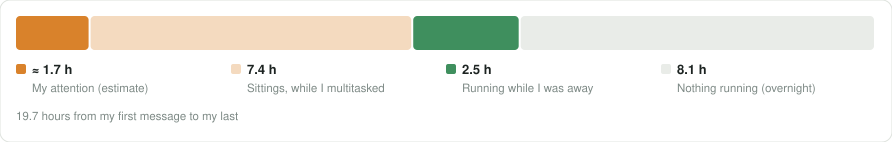

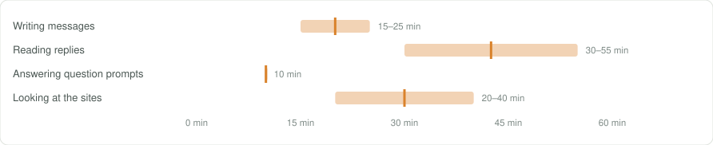

*I skim quickly and write by dictation or fast typing. These ranges assume I read 575 to 1,000 words a minute and wrote 120 to 200. I didn't track the time I spent looking at the sites, so that row is a guess.*

I sent 118 messages with about 3,000 words of my own. For every word I wrote, Claude wrote about 15 and read about 250 words of tool output — mostly files, logs, query results and test runs.

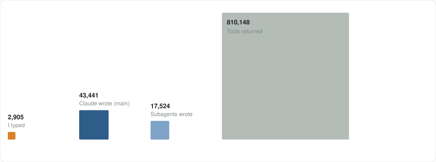

*Each square's area is proportional to its word count. Tool output is estimated at six characters per word, and Claude's count leaves out its hidden reasoning.*

The main conversation planned, reviewed, tested and committed the work. Eighteen subagents each took on one self-contained job, like building a Batch API backend, scaling the dashboard to 43,000 comments, profiling search with DevTools flame charts, or auditing submitter metadata. Between them, the subagents made most of the tool calls.

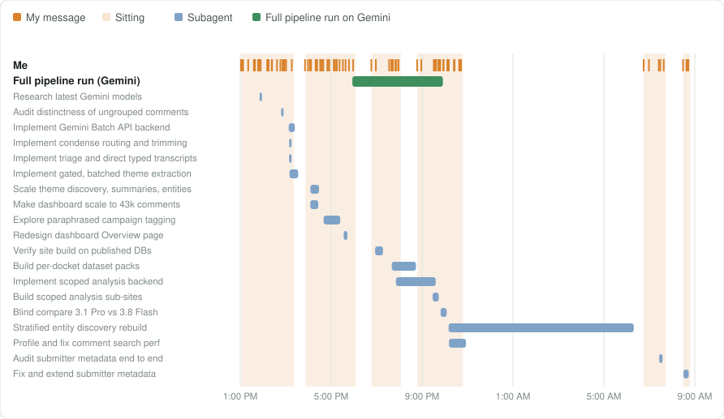

*Shaded bands show the sittings when I was in the conversation.*

Claude wrote all 49 commits, adding 11,496 lines of code and deleting 4,326. They went in as one pull request. The deletions include an older clustering method, a superseded summary command and settings that testing showed were no longer needed.

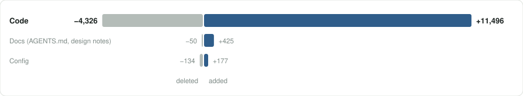

*These are net changes across 97 files. Counting code that was written and later rewritten, Claude added 12,840 lines and deleted 5,249.*

My role was to set the direction and review the results. I gave instructions like "Flash-Lite only for rote work" and "simple is good, but it can't be so simple it's shitty." I also caught several problems: "See attached" stubs grouped as a campaign, top-level themes showing zero comments, an entity list missing dQM and QRDA, and an overview headline that read like AI slop. In January I wrote that [subagents were getting easier to use](/blog/posts/sub-agents-are-getting-easier). This project relied on them throughout, and I coordinated them just by talking with the main Claude Code conversation instead of writing orchestration code.

## Links

- [Dashboard](https://joshuamandel.com/regulations.gov-comment-browser/CMS-2026-2377/)
- [AI skill](https://joshuamandel.com/regulations.gov-comment-browser/skill/SKILL.md)
- [Analysis databases](https://github.com/jmandel/regulations.gov-comment-browser/releases/tag/analysis-databases)
- [Code](https://github.com/jmandel/regulations.gov-comment-browser)
