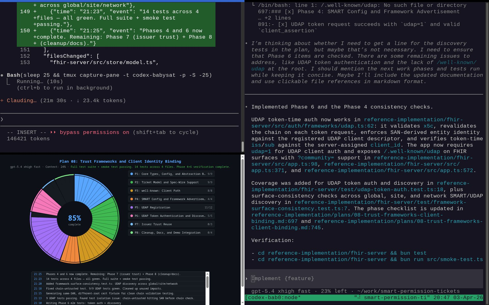

Codex 5.4 xhigh fast is cranking away in tmux, where Claude 4.6 Opus 1M can track + visualize its progress, do research in the background to anticipate needs, and nudge Codex to continue when it asks for feedback. SMART Permission Tickets reference implementation doesn't write itself... yet ;-) Happy Friday!

Link (from my first comment): <https://github.com/jmandel/skills/blob/main/babysit-codex/SKILL.md>
