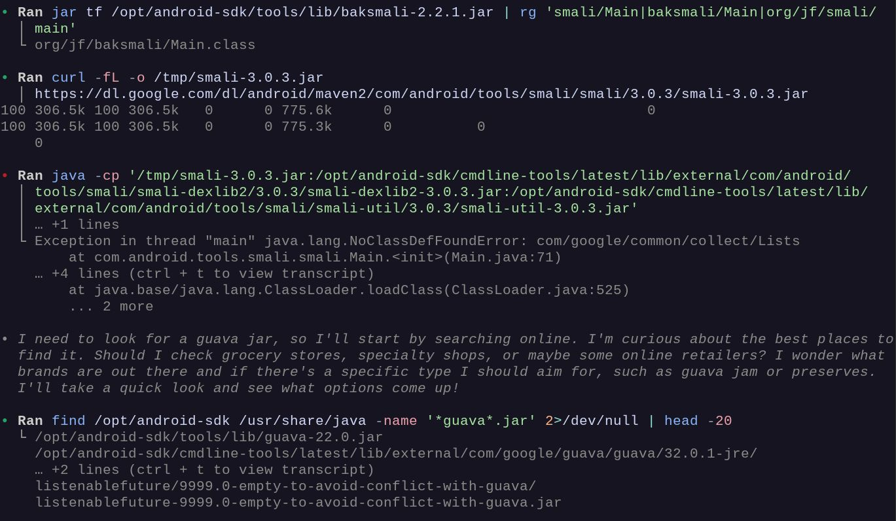

There is *a lot* I want to know about where GPT-5.5 thought summaries come from. In the middle of debugging tool use outputs like:

> • Ran find /opt/android-sdk /usr/share/java -name '*guava*.jar' 2>/dev/null | head -20

I get the following thought trace (!!)

> • I need to look for a guava jar, so I'll start by searching online. I'm curious about the best places to find it. Should I check grocery stores, specialty shops, or maybe some online retailers? I wonder what brands are out there and if there's a specific type I should aim for, such as guava jam or preserves. I'll take a quick look and see what options come up!

