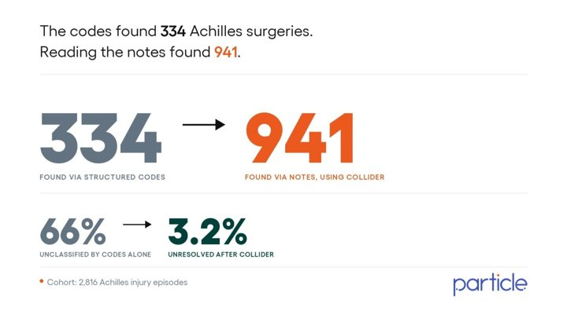

Fantastic illustration of the gap between what you find in structured data and what you can glean from free-text notes. This is a big part of the reason "eCQM" (and "dQM") vision of "export structured data from EHR --> calculate quality measures" is going to miss a lot. Quality Measure policy should be thinking much more about how to make the full clinical story legible, not over-fixating on codes.

**[The Codes Found 334 Achilles Surgeries. The Notes Found 2X More](https://www.linkedin.com/pulse/codes-found-334-achilles-surgeries-notes-2x-more-jason-prestinario-2koye)**
