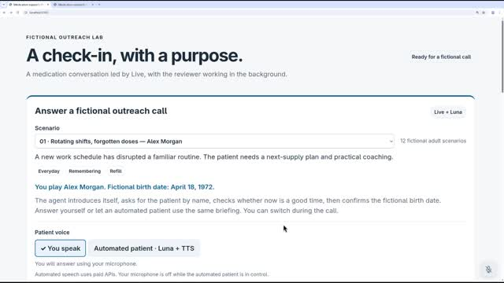

Fun demo for Friday afternoon: voice agents! Check out gpt-live-1 in a medication adherence check-in scenario. This should give you a sense of how the "live" model coordinates with an underlying reasoning model (through explicit delegation that's... not quite tool calling) and how thoughts/suggestions can be injected into live conversation. It's far from flawless but it still beats the pants off anything in my "real life consumer" experience.

[Watch the video on LinkedIn (7:24)](https://www.linkedin.com/feed/update/urn:li:ugcPost:7506820719977205760/)
